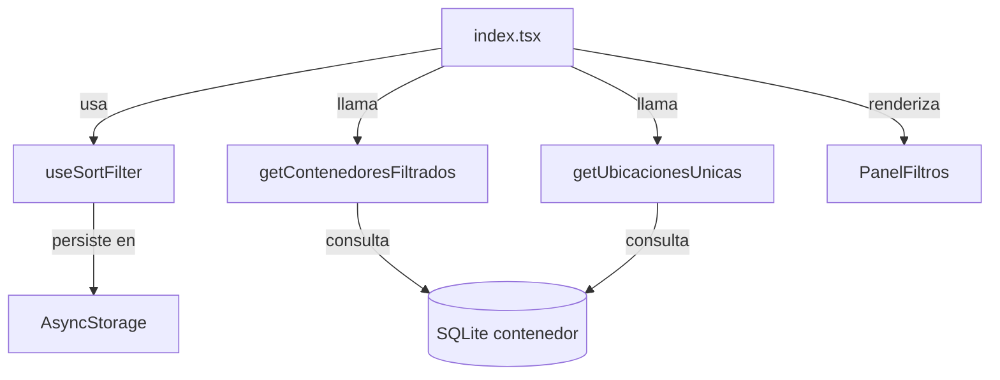

# Diseño Técnico — Ordenamiento y Filtros de Contenedores

## Visión General

Esta funcionalidad extiende la pantalla principal (`app/index.tsx`) de San Alejo para permitir al usuario ordenar la lista de contenedores por nombre, fecha de creación o cantidad de objetos, y filtrarla por ubicación. Requiere una migración de base de datos (v3 → v4) para agregar el campo `fecha_creacion` a la tabla `contenedor`, un nuevo método en el repositorio, un hook de estado reutilizable y un componente `PanelFiltros`.

El diseño sigue los patrones ya establecidos en el proyecto: acceso a datos centralizado en `src/db/`, componentes de UI en `src/components/`, theming vía `useTheme()`, y persistencia ligera con `AsyncStorage`.

---

## Arquitectura

```
app/index.tsx
  └── useSortFilter (hook)          ← estado de orden/filtro + persistencia
  └── getContenedoresFiltrados()    ← consulta SQL combinada
  └── getUbicacionesUnicas()        ← consulta SQL para el selector
  └── PanelFiltros (componente)     ← controles de UI (Modal/BottomSheet)
  └── ContenedorItem (sin cambios)
```



### Flujo de datos

1. Al montar `index.tsx`, `useSortFilter` carga el estado persistido (o usa los valores predeterminados).
2. `cargarContenedores()` llama a `getContenedoresFiltrados(db, filtroUbicacion, criterioOrden, direccionOrden)`.
3. El usuario abre `PanelFiltros` → selecciona criterio/dirección/ubicación → el hook actualiza el estado → se persiste → se recarga la lista.
4. `getUbicacionesUnicas(db)` se llama al abrir el panel para poblar el selector de ubicación.

---

## Componentes e Interfaces

### 1. `src/db/contenedorRepository.ts` — nuevas funciones

```typescript
export type CriterioOrden = 'nombre' | 'fecha_creacion' | 'cantidad_objetos';
export type DireccionOrden = 'asc' | 'desc';

export interface FiltroContenedor {
  filtroUbicacion: string | null;
  criterioOrden: CriterioOrden;
  direccionOrden: DireccionOrden;
}

/**
 * Retorna contenedores filtrados por ubicación y ordenados según los parámetros.
 * La cláusula ORDER BY se construye con valores de enumeración validados,
 * nunca interpolando texto arbitrario del usuario.
 */
export async function getContenedoresFiltrados(
  db: SQLiteDatabase,
  filtroUbicacion: string | null,
  criterioOrden: CriterioOrden,
  direccionOrden: DireccionOrden
): Promise<Contenedor[]>;

/**
 * Retorna los valores de ubicación únicos (no vacíos) presentes en la tabla.
 * Ordenados alfabéticamente.
 */
export async function getUbicacionesUnicas(
  db: SQLiteDatabase
): Promise<string[]>;
```

**Construcción segura de la consulta SQL:**

Los valores de `CriterioOrden` y `DireccionOrden` son tipos literales de TypeScript. En runtime se validan contra un conjunto de valores permitidos antes de interpolarse en la consulta. El `filtroUbicacion` se pasa siempre como parámetro enlazado (`?`), nunca interpolado.

```sql
-- Ejemplo para criterioOrden='cantidad_objetos', direccionOrden='desc', filtroUbicacion='Bodega'
SELECT c.*
FROM contenedor c
WHERE LOWER(c.ubicacion) = LOWER(?)
ORDER BY (SELECT COUNT(*) FROM objeto WHERE id_contenedor = c.id) DESC
```

```sql
-- Ejemplo para criterioOrden='nombre', direccionOrden='asc', filtroUbicacion=null
SELECT c.*
FROM contenedor c
ORDER BY c.nombre ASC
```

### 2. `src/hooks/useSortFilter.ts` — nuevo hook

```typescript
export interface SortFilterState {
  criterioOrden: CriterioOrden;
  direccionOrden: DireccionOrden;
  filtroUbicacion: string | null;
}

export const DEFAULT_SORT_FILTER: SortFilterState = {
  criterioOrden: 'nombre',
  direccionOrden: 'asc',
  filtroUbicacion: null,
};

export interface UseSortFilterReturn {
  state: SortFilterState;
  /** Selecciona un criterio; invierte la dirección si ya estaba activo. */
  setCriterio: (criterio: CriterioOrden) => void;
  setFiltroUbicacion: (ubicacion: string | null) => void;
  reset: () => void;
  /** true si el estado difiere de DEFAULT_SORT_FILTER */
  isNonDefault: boolean;
  isLoading: boolean;
}

export function useSortFilter(): UseSortFilterReturn;
```

**Lógica de toggle de dirección:**
```
setCriterio(nuevo):
  si nuevo === state.criterioOrden:
    invertir state.direccionOrden ('asc' ↔ 'desc')
  si no:
    state.criterioOrden = nuevo
    state.direccionOrden = 'asc'
```

**Persistencia:** usa `@react-native-async-storage/async-storage` bajo la clave `'sortFilter_v1'`. El estado se serializa como JSON. Al montar, se lee el valor persistido; si no existe o es inválido, se usan los valores predeterminados.

> **Nota:** `@react-native-async-storage/async-storage` no está en el proyecto actualmente. Se debe agregar como dependencia. Alternativa sin dependencia nueva: `expo-file-system` para escribir un archivo JSON de configuración en el directorio de documentos. Se recomienda `AsyncStorage` por ser el estándar en React Native para este caso de uso.

### 3. `src/components/PanelFiltros.tsx` — nuevo componente

```typescript
interface PanelFiltrosProps {
  visible: boolean;
  onClose: () => void;
  state: SortFilterState;
  ubicaciones: string[];
  onCriterioChange: (criterio: CriterioOrden) => void;
  onUbicacionChange: (ubicacion: string | null) => void;
  onReset: () => void;
}

export function PanelFiltros(props: PanelFiltrosProps): JSX.Element;
```

El panel se implementa como un `Modal` con `animationType="slide"` (bottom sheet manual), siguiendo el patrón de `ConfirmDialog.tsx`. Usa `useTheme()` para todos los colores.

**Estructura visual:**
- Cabecera con título "Ordenar y filtrar" + botón cerrar
- Sección "Ordenar por": tres botones de selección (`nombre`, `Fecha de creación`, `Cantidad de objetos`) con indicador de dirección (↑/↓) en el activo
- Sección "Filtrar por ubicación": lista de chips/botones con las ubicaciones únicas (oculta si `ubicaciones.length === 0`)
- Botón "Restablecer" (solo visible si `isNonDefault`)

### 4. `app/index.tsx` — modificaciones

- Importar `useSortFilter` y `PanelFiltros`.
- Reemplazar `getAllContenedores` por `getContenedoresFiltrados`.
- Agregar estado `panelVisible` y `ubicaciones`.
- Agregar botón de filtro en `headerRight` (junto al de búsqueda), con badge/punto cuando `isNonDefault`.
- Actualizar `ListEmptyComponent` para distinguir "sin contenedores" de "sin resultados con filtros activos".

### 5. `src/db/schema.ts` — migración v4

```typescript
const DATABASE_VERSION = 4;

// En el bloque de migración:
if (user_version === 3) {
  // v3 → v4: agregar fecha_creacion a contenedor
  await db.runAsync(
    'ALTER TABLE contenedor ADD COLUMN fecha_creacion INTEGER NOT NULL DEFAULT 0'
  );
}
```

La instalación fresca (user_version === 0) incluirá `fecha_creacion` en el `CREATE TABLE` inicial.

---

## Modelos de Datos

### Tipo `Contenedor` actualizado

```typescript
export interface Contenedor {
  id: number;
  nombre: string;
  descripcion: string;
  ubicacion: string;
  fecha_creacion: number; // timestamp Unix en segundos
}
```

### Clave de persistencia AsyncStorage

```
'sortFilter_v1' → JSON.stringify(SortFilterState)
```

### Versión de base de datos

| Versión | Cambio |
|---------|--------|
| 0 → 1   | Creación inicial |
| 1 → 2   | `foto_uri` en `objeto` |
| 2 → 3   | Tabla `objeto_foto` |
| 3 → 4   | `fecha_creacion` en `contenedor` |

---

## Propiedades de Corrección

*Una propiedad es una característica o comportamiento que debe cumplirse en todas las ejecuciones válidas del sistema — esencialmente, una afirmación formal sobre lo que el sistema debe hacer. Las propiedades sirven como puente entre las especificaciones legibles por humanos y las garantías de corrección verificables por máquina.*

### Propiedad 1: Round-trip de persistencia del estado de filtros

*Para cualquier* combinación válida de `criterioOrden`, `direccionOrden` y `filtroUbicacion`, persistir el estado y luego cargarlo debe retornar exactamente los mismos valores.

**Valida: Requisitos 2.6, 3.6**

### Propiedad 2: Toggle de dirección de orden

*Para cualquier* criterio de orden activo y dirección activa, llamar a `setCriterio` con el mismo criterio debe resultar en la dirección opuesta (`asc` → `desc` o `desc` → `asc`), manteniendo el mismo criterio.

**Valida: Requisito 2.4**

### Propiedad 3: Reset restaura el estado predeterminado

*Para cualquier* estado de filtros (criterio, dirección, ubicación), llamar a `reset()` debe resultar en exactamente `{ criterioOrden: 'nombre', direccionOrden: 'asc', filtroUbicacion: null }`.

**Valida: Requisito 4.5**

### Propiedad 4: isNonDefault es consistente con el estado predeterminado

*Para cualquier* estado de filtros, `isNonDefault` debe ser `true` si y solo si al menos uno de los valores difiere del predeterminado (`criterioOrden !== 'nombre'` || `direccionOrden !== 'asc'` || `filtroUbicacion !== null`).

**Valida: Requisito 4.1**

### Propiedad 5: Consistencia de resultados filtrados y ordenados

*Para cualquier* conjunto de contenedores en la base de datos y cualquier combinación válida de `filtroUbicacion`, `criterioOrden` y `direccionOrden`, `getContenedoresFiltrados` debe retornar un array tal que: (a) si `filtroUbicacion` no es null, todos los elementos tienen `ubicacion` que coincide case-insensitive con el filtro; (b) el array está ordenado correctamente según el criterio y la dirección especificados.

**Valida: Requisitos 2.1, 2.2, 3.2, 3.5, 5.5**

### Propiedad 6: Filtro null retorna todos los contenedores

*Para cualquier* conjunto de contenedores en la base de datos, llamar a `getContenedoresFiltrados` con `filtroUbicacion = null` debe retornar todos los contenedores (sin restricción de ubicación), solo afectados por el orden.

**Valida: Requisitos 3.3, 5.2**

### Propiedad 7: Unicidad de ubicaciones

*Para cualquier* conjunto de contenedores en la base de datos, `getUbicacionesUnicas` debe retornar un array sin duplicados que contenga exactamente los valores de `ubicacion` distintos y no vacíos presentes en la tabla.

**Valida: Requisito 3.1**

### Propiedad 8: Timestamp de inserción es válido

*Para cualquier* contenedor insertado con `insertContenedor`, el campo `fecha_creacion` recuperado debe ser un entero positivo mayor que 0 y no mayor que el timestamp Unix actual en el momento de la verificación.

**Valida: Requisito 1.2**

---

## Manejo de Errores

| Escenario | Comportamiento |
|-----------|---------------|
| Fallo al leer el estado persistido de AsyncStorage | Se usan los valores predeterminados; no se muestra error al usuario |
| Fallo al escribir el estado en AsyncStorage | Se ignora silenciosamente; el estado en memoria sigue siendo correcto |
| Fallo en `getContenedoresFiltrados` | Se muestra el banner de error existente en `index.tsx` |
| Fallo en `getUbicacionesUnicas` | El selector de ubicación se oculta (lista vacía); no bloquea la pantalla |
| Migración v3→v4 falla | El error se propaga desde `initializeDatabase`; la app no arranca (comportamiento existente) |
| Criterio u orden inválido en runtime | Se lanza un error en desarrollo; en producción se usa el valor predeterminado como fallback |

---

## Estrategia de Testing

### Enfoque dual

Se usan **tests de propiedad** (fast-check, ya instalado como devDependency) para las propiedades universales del repositorio y del hook, y **tests de ejemplo** para comportamientos específicos de UI y migración.

### Tests de propiedad (fast-check, mínimo 100 iteraciones)

Ubicación: `__tests__/unit/contenedorRepository.test.ts` (extender) y `__tests__/unit/useSortFilter.test.ts` (nuevo).

| Test | Propiedad | Archivo |
|------|-----------|---------|
| Consistencia de resultados filtrados y ordenados | Propiedad 5 | `contenedorRepository.test.ts` |
| Filtro null retorna todos | Propiedad 6 | `contenedorRepository.test.ts` |
| Unicidad de ubicaciones | Propiedad 7 | `contenedorRepository.test.ts` |
| Timestamp de inserción válido | Propiedad 8 | `contenedorRepository.test.ts` |
| Round-trip de persistencia | Propiedad 1 | `useSortFilter.test.ts` |
| Toggle de dirección | Propiedad 2 | `useSortFilter.test.ts` |
| Reset restaura predeterminado | Propiedad 3 | `useSortFilter.test.ts` |
| isNonDefault consistente | Propiedad 4 | `useSortFilter.test.ts` |

Etiqueta de cada test: `Feature: contenedor-sorting-filters, Property N: <texto>`

### Tests de ejemplo (jest + @testing-library/react-native)

| Test | Criterio |
|------|----------|
| Estado inicial del hook es el predeterminado | 2.5 |
| Migración v3→v4 agrega columna y preserva datos | 1.1, 1.4 |
| Migración es idempotente (doble ejecución sin error) | 1.3 |
| PanelFiltros oculta selector cuando ubicaciones=[] | 3.4 |
| index.tsx muestra mensaje de vacío con opción de limpiar filtros | 4.4 |
| Botón de filtro existe y es accesible | 4.3 |

### Tests de integración

| Test | Criterio |
|------|----------|
| Migración completa desde v0 incluye fecha_creacion | 1.1 |

### Lo que no se testea automáticamente

- Rendimiento < 300 ms (Requisito 4.2): verificación manual
- Apariencia visual del theming (Requisitos 4.6, 4.7): verificación manual o snapshot
