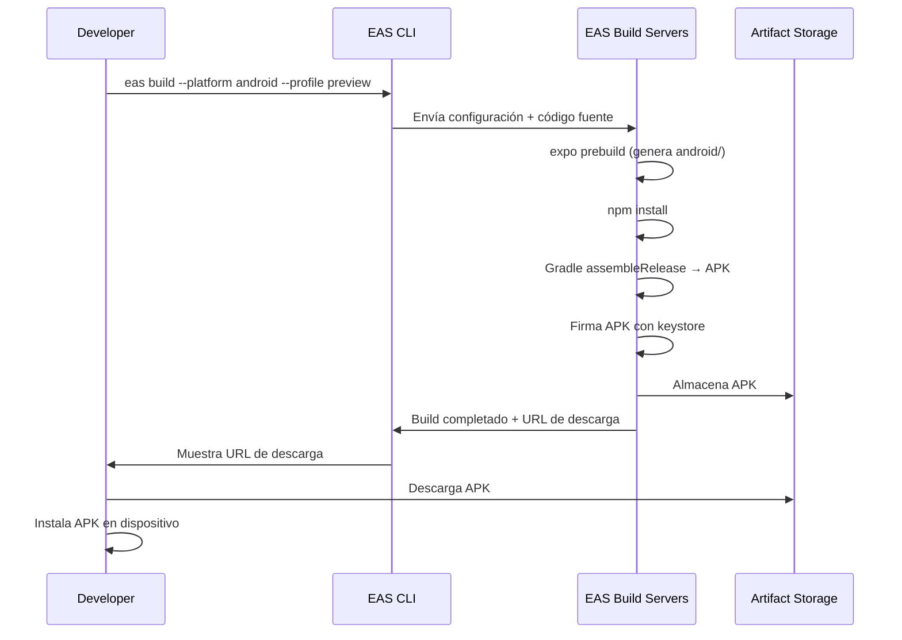

# Design Document: EAS Build Setup

## Overview

Este documento describe el diseño técnico para configurar EAS Build en el proyecto SanAlejo, una aplicación Expo (React Native) con SDK ~54 y nueva arquitectura habilitada (`newArchEnabled: true`). El objetivo es habilitar la generación de un APK de Android en la nube sin necesidad de tener Android Studio ni el SDK de Android instalados localmente.

EAS Build es un servicio de compilación remota de Expo Application Services. El flujo consiste en: instalar y autenticar EAS CLI → configurar el proyecto → definir perfiles de compilación en `eas.json` → ejecutar el build → descargar el APK resultante.

### Decisiones de diseño clave

- **Managed Workflow**: El proyecto usa Managed Workflow (sin carpetas `android/` ni `ios/` expuestas), lo que simplifica la configuración de EAS Build ya que Expo gestiona la configuración nativa.
- **Perfil `preview` para APK**: Se usa `android.buildType: "apk"` con `distribution: "internal"` para generar un APK instalable directamente en dispositivos físicos, sin pasar por Google Play Store.
- **Perfil `production` para AAB**: Se usa la configuración por defecto (AAB) para distribución futura en Google Play Store.
- **Gestión automática de credenciales**: EAS gestiona el keystore de firma en sus servidores, eliminando la necesidad de configuración manual.
- **Nueva arquitectura**: `newArchEnabled: true` se mantiene en `app.json`; Expo SDK 54 es compatible con la nueva arquitectura de React Native.

---

## Architecture

El sistema involucra tres capas:

```
┌─────────────────────────────────────────────────────────┐
│                   Developer (local)                      │
│  ┌──────────────┐    ┌──────────────┐    ┌───────────┐  │
│  │  EAS CLI     │    │  app.json    │    │  eas.json │  │
│  │  (global)    │    │  (config)    │    │  (config) │  │
│  └──────┬───────┘    └──────────────┘    └───────────┘  │
│         │                                                │
└─────────┼────────────────────────────────────────────────┘
          │ HTTPS (eas build command)
          ▼
┌─────────────────────────────────────────────────────────┐
│                  EAS Build Servers (Expo)                │
│  ┌──────────────────────────────────────────────────┐   │
│  │  Build Worker                                    │   │
│  │  - Clona el código fuente                        │   │
│  │  - Instala dependencias (npm install)            │   │
│  │  - Ejecuta expo prebuild (genera android/)       │   │
│  │  - Compila con Gradle (assembleRelease/bundleRelease) │
│  │  - Firma el APK/AAB con el keystore gestionado   │   │
│  └──────────────────────────────────────────────────┘   │
│  ┌──────────────────────────────────────────────────┐   │
│  │  Credential Storage                              │   │
│  │  - Keystore Android (gestionado por EAS)         │   │
│  └──────────────────────────────────────────────────┘   │
│  ┌──────────────────────────────────────────────────┐   │
│  │  Artifact Storage                                │   │
│  │  - APK / AAB generado (URL de descarga)          │   │
│  └──────────────────────────────────────────────────┘   │
└─────────────────────────────────────────────────────────┘
```

### Flujo de compilación



---

## Components and Interfaces

### 1. EAS CLI

**Herramienta**: `eas-cli` (instalación global via npm)

Comandos relevantes para este feature:

| Comando | Propósito |
|---|---|
| `npm install -g eas-cli` | Instala EAS CLI globalmente |
| `eas login` | Autentica con la cuenta de Expo |
| `eas whoami` | Verifica la sesión activa |
| `eas init` | Vincula el proyecto con EAS y genera `projectId` |
| `eas build:configure` | Genera el archivo `eas.json` inicial |
| `eas build --platform android --profile preview` | Inicia compilación APK |
| `eas build --platform android --profile production` | Inicia compilación AAB |
| `eas credentials` | Gestiona credenciales de firma |
| `eas build:run -p android` | Descarga e instala build en emulador |

### 2. app.json

Archivo de configuración de Expo. Requiere los siguientes campos para EAS Build:

```json
{
  "expo": {
    "name": "SanAlejo",
    "slug": "SanAlejo",
    "version": "1.0.0",
    "newArchEnabled": true,
    "android": {
      "package": "com.sanalejo.app",
      "adaptiveIcon": {
        "foregroundImage": "./assets/adaptive-icon.png",
        "backgroundColor": "#ffffff"
      }
    },
    "extra": {
      "eas": {
        "projectId": "<uuid-generado-por-eas-init>"
      }
    }
  }
}
```

Campos críticos:
- `expo.android.package`: Identificador único de la app Android (formato dominio inverso).
- `expo.newArchEnabled`: Debe mantenerse en `true`.
- `expo.extra.eas.projectId`: Generado automáticamente por `eas init`.

### 3. eas.json

Archivo de configuración de EAS Build. Define los perfiles de compilación:

```json
{
  "cli": {
    "version": ">= 16.0.0"
  },
  "build": {
    "preview": {
      "distribution": "internal",
      "android": {
        "buildType": "apk"
      }
    },
    "production": {
      "android": {
        "buildType": "app-bundle"
      }
    }
  }
}
```

Descripción de perfiles:

| Perfil | Plataforma | Artefacto | Distribución | Uso |
|---|---|---|---|---|
| `preview` | Android | APK | Internal | Pruebas en dispositivo físico |
| `production` | Android | AAB | Store | Google Play Store |

---

## Data Models

### Estructura de archivos del proyecto tras la configuración

```
SanAlejo/
├── app.json              ← Modificado: android.package + extra.eas.projectId
├── eas.json              ← Nuevo: perfiles de compilación
├── package.json          ← Sin cambios
└── ...
```

### Campos de app.json relevantes

| Campo | Tipo | Requerido | Descripción |
|---|---|---|---|
| `expo.android.package` | string | Sí | applicationId Android. Formato: `[a-z][a-z0-9_]*(\.[a-z][a-z0-9_]*)+` |
| `expo.newArchEnabled` | boolean | Sí | Habilita la nueva arquitectura de React Native |
| `expo.extra.eas.projectId` | string (UUID) | Sí (tras `eas init`) | Identificador del proyecto en EAS |
| `expo.android.minSdkVersion` | number | No | Mínimo API level. Expo SDK 54 usa 24 por defecto |

### Campos de eas.json relevantes

| Campo | Tipo | Valores válidos | Descripción |
|---|---|---|---|
| `build.preview.distribution` | string | `"internal"`, `"store"` | Modalidad de distribución |
| `build.preview.android.buildType` | string | `"apk"`, `"app-bundle"` | Tipo de artefacto Android |
| `build.production.android.buildType` | string | `"apk"`, `"app-bundle"` | Tipo de artefacto Android |
| `cli.version` | string (semver range) | `">= X.Y.Z"` | Versión mínima de EAS CLI requerida |

### Credenciales de firma Android

EAS gestiona el keystore en sus servidores. No se almacena localmente. El flujo de credenciales:

```
Primera compilación:
  EAS CLI pregunta → "Generate new keystore" (opción recomendada)
  → EAS genera keystore → almacena en Expo servers → firma APK

Compilaciones posteriores:
  EAS reutiliza el keystore almacenado automáticamente

Alternativa (keystore propio):
  eas credentials → subir keystore existente
```

---

## Error Handling

### Errores comunes y resolución

| Error | Causa | Resolución |
|---|---|---|
| `expo.android.package` ausente | `app.json` no tiene el campo `android.package` | Agregar `"android": { "package": "com.sanalejo.app" }` en `app.json` |
| `Not logged in` | EAS CLI no tiene sesión activa | Ejecutar `eas login` |
| `Project not linked` | `eas init` no se ha ejecutado | Ejecutar `eas init` en el directorio `SanAlejo/` |
| Build falla por dependencia incompatible con nueva arquitectura | Librería no soporta New Architecture | Verificar compatibilidad; como último recurso, desactivar `newArchEnabled` |
| `eas-cli` versión desactualizada | Versión instalada no cumple el rango en `eas.json` | Ejecutar `npm install -g eas-cli` para actualizar |
| Build falla por error de Gradle | Problema en la compilación nativa | Revisar logs en el dashboard de Expo (URL provista por EAS CLI) |

### Compatibilidad con nueva arquitectura (Expo SDK 54)

Expo SDK 54 es la última versión que soporta la arquitectura legacy. Con `newArchEnabled: true`, todas las dependencias del proyecto deben ser compatibles con la Nueva Arquitectura. Las dependencias actuales del proyecto han sido verificadas:

| Dependencia | Versión | Compatible con New Arch |
|---|---|---|
| `expo-sqlite` | ~16.0.10 | ✅ Sí |
| `expo-router` | ~6.0.23 | ✅ Sí |
| `expo-image-picker` | ~16.0.6 | ✅ Sí |
| `expo-file-system` | ~18.0.12 | ✅ Sí |
| `expo-print` | ~15.0.8 | ✅ Sí |
| `expo-sharing` | ~14.0.8 | ✅ Sí |
| `react-native-gesture-handler` | ~2.28.0 | ✅ Sí |
| `react-native-reanimated` | ~4.1.1 | ✅ Sí |
| `react-native-screens` | ~4.16.0 | ✅ Sí |
| `@react-native-async-storage/async-storage` | 3.1.0 | ✅ Sí |

Si en el futuro se agrega una dependencia incompatible, se debe documentar en este archivo y evaluar alternativas antes de desactivar `newArchEnabled`.

---

## Testing Strategy

Este feature es puramente de configuración de herramientas externas (EAS CLI, EAS Build, archivos JSON). No contiene lógica de código propia que pueda ser sometida a property-based testing. Por ello, **la sección de Correctness Properties se omite** y la estrategia de testing se basa en verificaciones de configuración (smoke tests) y pruebas de integración manuales.

### Por qué no aplica PBT

Todas las acceptance criteria de este feature caen en las categorías SMOKE o INTEGRATION:
- Las verificaciones de `app.json` y `eas.json` son validaciones de archivos de configuración estáticos.
- El comportamiento de EAS CLI y EAS Build son servicios externos de terceros.
- No existe lógica de transformación de datos propia que justifique generar 100+ inputs aleatorios.

### Smoke Tests (verificaciones de configuración)

Estas verificaciones se pueden ejecutar localmente sin necesidad de compilar:

**1. Verificar `app.json` tiene `android.package`**
```bash
# Debe retornar "com.sanalejo.app" (o el valor configurado)
node -e "const a = require('./app.json'); console.log(a.expo.android.package)"
```

**2. Verificar `app.json` mantiene `newArchEnabled: true`**
```bash
node -e "const a = require('./app.json'); console.log(a.expo.newArchEnabled)"
# Debe retornar: true
```

**3. Verificar `eas.json` tiene el perfil `preview` con `buildType: "apk"`**
```bash
node -e "const e = require('./eas.json'); console.log(e.build.preview.android.buildType)"
# Debe retornar: apk
```

**4. Verificar `eas.json` tiene el perfil `production`**
```bash
node -e "const e = require('./eas.json'); console.log(JSON.stringify(e.build.production))"
```

**5. Verificar autenticación EAS CLI**
```bash
eas whoami
# Debe retornar el nombre de usuario de Expo
```

**6. Verificar vinculación del proyecto**
```bash
node -e "const a = require('./app.json'); console.log(a.expo.extra?.eas?.projectId)"
# Debe retornar un UUID válido tras ejecutar `eas init`
```

### Integration Tests (verificaciones de compilación)

Estas verificaciones requieren ejecutar EAS Build y consumen créditos de compilación:

**1. Build de preview (APK)**
```bash
eas build --platform android --profile preview
# Verificar: build completa sin errores, artefacto es un APK descargable
```

**2. Verificar compatibilidad con nueva arquitectura**
```bash
eas build --platform android --profile preview
# Verificar: no hay errores relacionados con New Architecture en los logs
```

**3. Verificar gestión de credenciales**
```bash
# En la primera compilación, EAS CLI pregunta por el keystore
# Seleccionar "Generate new keystore"
# Verificar en https://expo.dev/accounts/<usuario>/projects/<slug>/credentials
# que el keystore está almacenado
```

### Checklist de verificación manual

Antes de considerar el feature completo, verificar:

- [ ] `eas-cli` instalado globalmente (`eas --version`)
- [ ] Sesión activa en EAS (`eas whoami`)
- [ ] `app.json` contiene `expo.android.package` con formato válido
- [ ] `app.json` mantiene `expo.newArchEnabled: true`
- [ ] `app.json` contiene `expo.extra.eas.projectId` (UUID)
- [ ] `eas.json` existe en `SanAlejo/`
- [ ] `eas.json` perfil `preview` tiene `android.buildType: "apk"` y `distribution: "internal"`
- [ ] `eas.json` perfil `production` existe
- [ ] Build de `preview` completa exitosamente
- [ ] APK generado es descargable e instalable en dispositivo Android (API 24+)
- [ ] Keystore gestionado por EAS aparece en el dashboard de Expo
