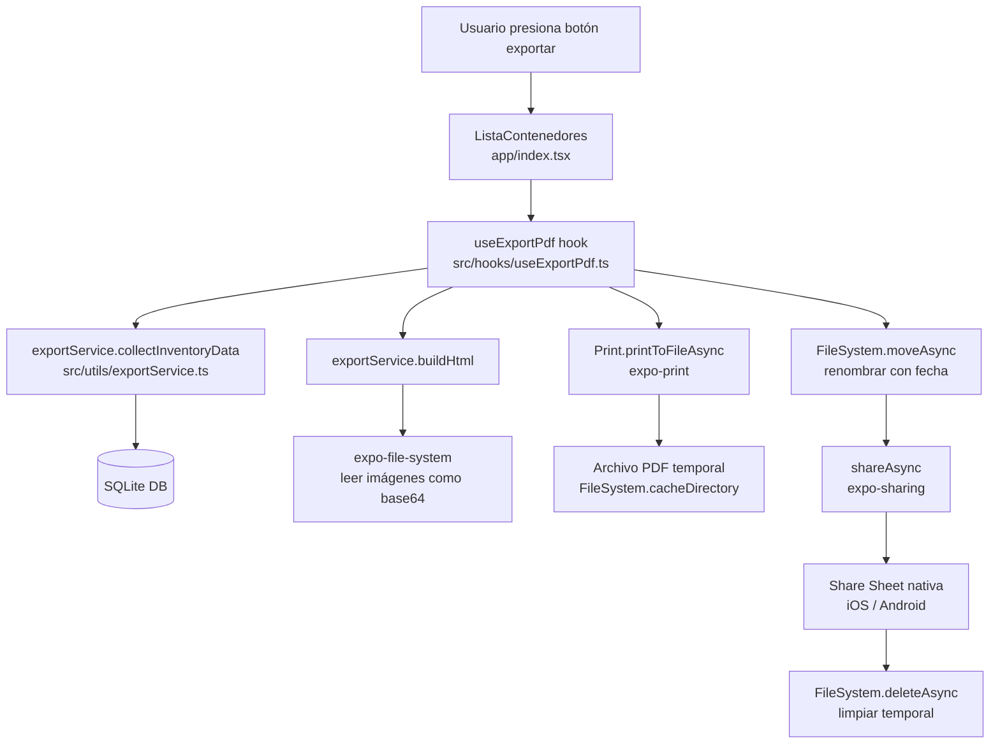
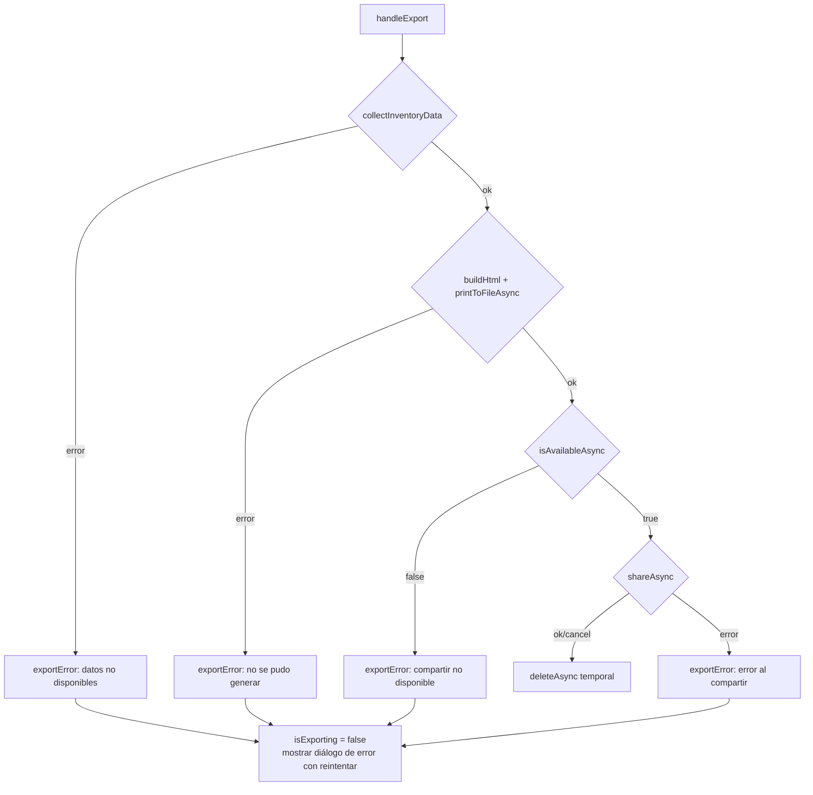

# Design Document — Export PDF

## Overview

La funcionalidad de exportación a PDF permite al usuario generar un archivo PDF con el inventario completo (contenedores, objetos, etiquetas y fotos) directamente en el dispositivo, sin necesidad de conexión a internet ni servicios externos. El PDF se genera a partir de una plantilla HTML renderizada por el motor nativo del sistema operativo mediante `expo-print`, y se comparte a través del Share Sheet nativo usando `expo-sharing`.

### Decisiones de diseño clave

- **expo-print + expo-sharing**: Es el stack oficial de Expo para este caso de uso. `Print.printToFileAsync({ html })` convierte HTML a PDF usando el motor nativo (WKWebView en iOS, WebView en Android), lo que garantiza compatibilidad sin dependencias nativas adicionales. `shareAsync` activa el Share Sheet nativo con el archivo adjunto.
- **Plantilla HTML pura**: La generación del PDF se basa en construir un string HTML con los datos del inventario. Esto desacopla la lógica de datos de la presentación y hace que la función sea pura y fácilmente testeable.
- **Archivo temporal**: El PDF se escribe en el directorio de caché del dispositivo y se elimina tras compartir, evitando acumulación de archivos.
- **Botón en el header de la pantalla principal**: Sigue el patrón existente de la app (botones de filtro y búsqueda en el header de `Stack.Screen`).

---

## Architecture



El flujo es completamente local y secuencial. No hay estado global ni contexto compartido; toda la lógica vive en el hook `useExportPdf` y el servicio `exportService`.

---

## Components and Interfaces

### 1. `useExportPdf` hook — `src/hooks/useExportPdf.ts`

Hook que encapsula el estado y la lógica del proceso de exportación. Lo consume `app/index.tsx`.

```typescript
interface UseExportPdfResult {
  isExporting: boolean;
  exportError: string | null;
  handleExport: () => Promise<void>;
  clearError: () => void;
}

function useExportPdf(db: SQLiteDatabase): UseExportPdfResult
```

Responsabilidades:
- Gestionar el estado `isExporting` (muestra/oculta el indicador de progreso).
- Gestionar el estado `exportError` (muestra/oculta el mensaje de error).
- Orquestar la llamada a `exportService` y `expo-print` / `expo-sharing`.
- Limpiar el archivo temporal tras compartir (o en caso de error).

### 2. `exportService` — `src/utils/exportService.ts`

Módulo de funciones puras (o casi puras) que contiene la lógica de recopilación de datos y construcción del HTML. Es el núcleo testeable de la feature.

```typescript
// Tipos de datos del inventario
export interface FotoData {
  uri: string;
  orden: number;
}

export interface ObjetoData {
  id: number;
  nombre: string;
  descripcion: string;
  etiquetas: string[];
  fotos: FotoData[];
}

export interface ContenedorData {
  id: number;
  nombre: string;
  descripcion: string;
  ubicacion: string;
  objetos: ObjetoData[];
}

export interface InventarioData {
  contenedores: ContenedorData[];
  totalObjetos: number;
  generadoEn: Date;
}

// Recopila todos los datos del inventario desde la BD
export async function collectInventoryData(
  db: SQLiteDatabase
): Promise<InventarioData>

// Construye el string HTML completo para el PDF
// Las imágenes se incrustan como data URIs base64
export async function buildHtml(data: InventarioData): Promise<string>

// Genera el nombre de archivo con la fecha
export function buildFileName(date: Date): string

// Lee una imagen del FileSystem y la convierte a data URI base64
// Retorna null si el archivo no existe o no se puede leer
export async function readImageAsBase64(uri: string): Promise<string | null>
```

### 3. Modificación de `app/index.tsx`

Se añade el botón de exportación al `headerRight` de `Stack.Screen`, junto al botón de filtros y búsqueda existentes. El botón se deshabilita (o se oculta) cuando `contenedores.length === 0`.

Se añade el modal de progreso (overlay con `ActivityIndicator` y texto "Generando PDF…") y el diálogo de error con opción de reintentar.

---

## Data Models

### Flujo de datos

```
SQLite
  contenedor (id, nombre, descripcion, ubicacion, fecha_creacion)
    └── objeto (id, nombre, descripcion, id_contenedor)
          ├── objeto_foto (id, id_objeto, uri, orden)
          └── objeto_etiqueta → etiqueta (id, nombre)
```

### `InventarioData` (modelo en memoria para la exportación)

```typescript
{
  contenedores: [
    {
      id: 1,
      nombre: "Caja Ropa Invierno",
      descripcion: "Ropa de abrigo",
      ubicacion: "Armario principal",
      objetos: [
        {
          id: 10,
          nombre: "Bufanda azul",
          descripcion: "Bufanda de lana",
          etiquetas: ["ropa", "invierno"],
          fotos: [
            { uri: "file:///...", orden: 0 },
            { uri: "file:///...", orden: 1 }
          ]
        }
      ]
    }
  ],
  totalObjetos: 1,
  generadoEn: Date
}
```

### Estrategia de imágenes en el PDF

`expo-print` renderiza HTML con el motor nativo. Las imágenes referenciadas con `file://` URIs locales **no son accesibles** desde el contexto del WebView en todos los casos (especialmente en Android). La solución es convertir cada imagen a una **data URI base64** e incrustarla directamente en el HTML:

```html

```

Esto garantiza que las imágenes aparezcan correctamente en el PDF en ambas plataformas. Si la lectura de un archivo falla, se omite la imagen sin interrumpir la generación.

### Nombre del archivo temporal

```
inventario-san-alejo-YYYY-MM-DD.pdf
```

Ejemplo: `inventario-san-alejo-2025-01-15.pdf`

El archivo se guarda en `FileSystem.cacheDirectory` durante el proceso de compartir y se elimina inmediatamente después.

---

## Correctness Properties

*Una propiedad es una característica o comportamiento que debe cumplirse en todas las ejecuciones válidas del sistema — esencialmente, una declaración formal sobre lo que el software debe hacer. Las propiedades sirven como puente entre las especificaciones legibles por humanos y las garantías de corrección verificables automáticamente.*

Esta feature incluye lógica de transformación de datos (recopilación, ordenamiento, construcción de HTML, generación de nombres de archivo) que es adecuada para property-based testing. Las funciones de `exportService` son puras o casi puras y sus propiedades se pueden verificar con muchas entradas generadas aleatoriamente.

### Property 1: Contenedores ordenados alfabéticamente

*Para cualquier* conjunto de contenedores con nombres arbitrarios, la función `collectInventoryData` (o la consulta SQL subyacente) debe devolver los contenedores ordenados alfabéticamente por nombre de forma ascendente.

**Validates: Requirements 2.1**

### Property 2: Objetos de cada contenedor ordenados alfabéticamente

*Para cualquier* contenedor con un conjunto arbitrario de objetos, los objetos devueltos para ese contenedor deben estar ordenados alfabéticamente por nombre de forma ascendente.

**Validates: Requirements 2.2**

### Property 3: El HTML generado contiene todos los datos de cada contenedor

*Para cualquier* `InventarioData` con contenedores de nombre, descripción y ubicación arbitrarios, el HTML generado por `buildHtml` debe contener el nombre, la descripción y la ubicación de cada contenedor.

**Validates: Requirements 2.5, 3.1**

### Property 4: El HTML generado contiene todos los datos de cada objeto

*Para cualquier* `InventarioData` con objetos de nombre, descripción, etiquetas y fotos arbitrarios, el HTML generado por `buildHtml` debe contener el nombre, la descripción y todas las etiquetas de cada objeto.

**Validates: Requirements 2.6, 3.3**

### Property 5: El encabezado del HTML contiene el título y los conteos correctos

*Para cualquier* `InventarioData` con un número arbitrario de contenedores y objetos, el HTML generado por `buildHtml` debe contener el texto "Inventario San Alejo", el número total de contenedores y el número total de objetos.

**Validates: Requirements 3.6, 3.7**

### Property 6: El nombre de archivo siempre sigue el formato correcto

*Para cualquier* objeto `Date` válido, la función `buildFileName` debe devolver un string que coincida con el patrón `inventario-san-alejo-YYYY-MM-DD.pdf`, donde YYYY, MM y DD corresponden al año, mes y día de la fecha proporcionada.

**Validates: Requirements 5.2**

---

## Error Handling

### Errores de base de datos (Requirement 6.1)

Si `collectInventoryData` lanza una excepción, el hook `useExportPdf` captura el error, establece `isExporting = false` y `exportError = "No se pudieron obtener los datos del inventario."`.

### Errores de generación de PDF (Requirement 6.2)

Si `Print.printToFileAsync` lanza una excepción, el hook captura el error, establece `isExporting = false` y `exportError = "No se pudo generar el PDF."`. El archivo temporal (si existe) se elimina.

### Errores de escritura de archivo (Requirement 6.3)

`Print.printToFileAsync` maneja internamente la escritura del archivo. Si falla, se trata como error de generación (ver arriba).

### Imágenes no legibles (Requirement 3.8)

`readImageAsBase64` envuelve la lectura en un try/catch. Si `FileSystem.readAsStringAsync` falla para una URI específica, la función retorna `null`. `buildHtml` omite la imagen cuando recibe `null`, sin interrumpir la generación del resto del documento.

### Share Sheet no disponible (Requirement 5.4)

Antes de llamar a `shareAsync`, el hook verifica `Sharing.isAvailableAsync()`. Si retorna `false`, establece `exportError = "No se pudo compartir el archivo en este dispositivo."`.

### Limpieza del archivo temporal

El archivo temporal se elimina en el bloque `finally` del hook, garantizando que se limpie tanto en caso de éxito como de error. Se usa `FileSystem.deleteAsync(uri, { idempotent: true })` para tolerar el caso en que el archivo no exista.

### Diagrama de flujo de errores



---

## Testing Strategy

### Enfoque dual

La estrategia combina tests de ejemplo (para comportamientos específicos y flujos de UI) con tests de propiedad (para invariantes universales de las funciones de transformación de datos).

### Tests de propiedad (fast-check)

El proyecto ya incluye `fast-check` como dependencia de desarrollo. Se usará para verificar las propiedades definidas en la sección anterior.

Cada test de propiedad se ejecuta con un mínimo de 100 iteraciones. Se ubican en `SanAlejo/__tests__/unit/exportService.property.test.ts`.

**Configuración de tags:**
```typescript
// Feature: export-pdf, Property 1: contenedores ordenados alfabéticamente
fc.assert(fc.property(fc.array(arbitraryContenedor()), (contenedores) => {
  // ...
}), { numRuns: 100 });
```

**Propiedades a implementar:**

| Test | Propiedad | Función bajo test |
|------|-----------|-------------------|
| Property 1 | Contenedores ordenados alfabéticamente | `collectInventoryData` / SQL query |
| Property 2 | Objetos de cada contenedor ordenados alfabéticamente | `collectInventoryData` / SQL query |
| Property 3 | HTML contiene datos de cada contenedor | `buildHtml` |
| Property 4 | HTML contiene datos de cada objeto | `buildHtml` |
| Property 5 | HTML contiene título y conteos correctos | `buildHtml` |
| Property 6 | Nombre de archivo sigue el formato correcto | `buildFileName` |

**Generadores arbitrarios necesarios:**
- `arbitraryNombre()`: string no vacío, sin caracteres de control
- `arbitraryContenedor()`: objeto `ContenedorData` con nombre, descripcion, ubicacion arbitrarios y lista de objetos vacía o con elementos
- `arbitraryObjeto()`: objeto `ObjetoData` con nombre, descripcion, etiquetas y fotos arbitrarios
- `arbitraryInventarioData()`: `InventarioData` completo con fecha arbitraria

### Tests de ejemplo (Jest + @testing-library/react-native)

Se ubican en los directorios existentes según el tipo:

**`SanAlejo/__tests__/unit/exportService.test.ts`**
- `buildFileName` con fechas concretas (inicio de año, fin de año, mes con cero)
- `readImageAsBase64` retorna `null` cuando el archivo no existe (mock de FileSystem)
- `buildHtml` omite sección de imágenes cuando `fotos` está vacío (Requirement 3.5)
- `buildHtml` incluye indicador de vacío cuando `objetos` está vacío (Requirement 3.2)
- `buildHtml` incluye `max-width: 100%` en imágenes (Requirement 3.4)

**`SanAlejo/__tests__/screens/ListaContenedores.export.test.tsx`**
- Botón de exportación presente en el header cuando hay contenedores
- Botón de exportación deshabilitado/ausente cuando no hay contenedores (Requirement 1.3)
- Indicador de progreso visible durante la exportación (Requirement 4.1, 4.3)
- Indicador de progreso oculto tras completar (Requirement 4.2)
- Diálogo de error visible con opción de reintentar cuando falla (Requirement 6.4)
- Share Sheet no disponible muestra mensaje de error (Requirement 5.4)

**`SanAlejo/__tests__/unit/useExportPdf.test.ts`**
- `handleExport` llama a `shareAsync` con el URI correcto tras generación exitosa (Requirement 5.1)
- `handleExport` llama a `deleteAsync` tras compartir (Requirement 5.3)
- `handleExport` llama a `deleteAsync` en caso de error (limpieza garantizada)
- Error de BD establece `exportError` con mensaje apropiado (Requirement 6.1)
- Error de `printToFileAsync` establece `exportError` con mensaje apropiado (Requirement 6.2)

### Mocks necesarios

```typescript
// SanAlejo/__mocks__/expo-print.js
export const Print = {
  printToFileAsync: jest.fn(),
};

// SanAlejo/__mocks__/expo-sharing.js
export const shareAsync = jest.fn();
export const isAvailableAsync = jest.fn(() => Promise.resolve(true));
```

### Cobertura objetivo

- `exportService.ts`: ≥ 90% (funciones puras, fácilmente testeable)
- `useExportPdf.ts`: ≥ 80% (lógica de orquestación con mocks)
- `app/index.tsx` (cambios de exportación): cubierto por tests de pantalla existentes + nuevos
