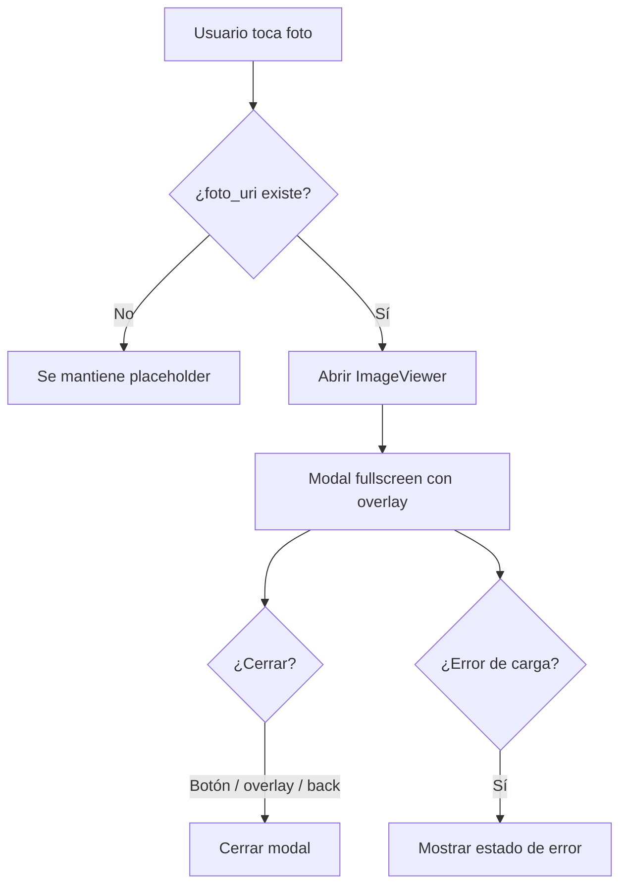

# Design Document — Image Viewer

## Overview

La funcionalidad de visor de imagen agrega un modal reutilizable a pantalla completa para ampliar la foto asociada a un objeto. El objetivo es resolver dos casos de uso sin duplicar lógica: abrir la imagen desde el detalle de un contenedor y abrir la vista previa desde los formularios de objeto.

### Decisiones de diseño clave

- **Componente autocontenido**: `ImageViewer` encapsula overlay, cierre, carga de imagen y manejo de error.
- **Sin dependencias nuevas**: la solución usa `Modal`, `Pressable`, `Image` e `Ionicons` de React Native / Expo ya disponibles en el proyecto.
- **Tematización nativa**: los colores salen de `useTheme()` y de los tokens existentes (`overlay`, `bgElevated`, `textPrimary`, `textMuted`, `textOnAccent`).
- **Integración por composición**: las pantallas existentes solo controlan `visible`, `uri` y `onClose`; no se introduce navegación dedicada ni estado global nuevo.
- **Accesibilidad explícita**: el botón de cierre y la imagen exponen etiquetas y roles para lectores de pantalla.

---

## Architecture

El visor se ubica en la capa de UI y se integra como un componente reutilizable. No requiere cambios en la capa de datos.

```text
┌─────────────────────────────────────────────┐
│                  UI Layer                    │
│  Detalle_Contenedor / Formulario_Objeto      │
│        └── ImageViewer                       │
├─────────────────────────────────────────────┤
│              Theme Layer                     │
│          ThemeContext + useTheme             │
├─────────────────────────────────────────────┤
│              Data Layer                      │
│      Sin cambios: usa foto_uri existente     │
└─────────────────────────────────────────────┘
```

### Flujo de interacción



### Estructura de archivos propuesta

```text
src/
├── components/
│   ├── ImageViewer.tsx       ← Nuevo componente reutilizable
│   └── ...                   ← Componentes existentes sin cambios estructurales
└── theme.ts                  ← Tokens ya existentes para overlay y colores
```

---

## Components and Interfaces

### ImageViewer (`src/components/ImageViewer.tsx`)

El componente debe ser controlado por props y no mantener una sesión propia de navegación.

```typescript
interface ImageViewerProps {
	uri: string;
	visible: boolean;
	onClose: () => void;
}
```

#### Responsabilidades

- Renderizar un `Modal` de pantalla completa cuando `visible` sea `true`.
- Cerrar el visor cuando el usuario toca el botón de cierre, el overlay o el gesto de atrás del dispositivo.
- Mostrar la imagen centrada y escalada al máximo espacio disponible conservando la relación de aspecto.
- Mostrar un estado de error si la imagen no puede cargarse.
- Aplicar estilos dependientes del tema activo en tiempo real.

#### Comportamiento interno esperado

- El overlay cubre toda la pantalla y usa `colors.overlay`.
- El contenedor principal alinea la imagen al centro y deja espacio para el botón de cierre.
- La imagen usa `resizeMode="contain"` para preservar proporción.
- El estado de error reemplaza la imagen por un ícono de error y el mensaje `No se pudo cargar la imagen`.
- El botón de cierre usa `Ionicons` con `accessibilityRole="button"` y `accessibilityLabel="Cerrar visor de imagen"`.

### Integración en pantallas existentes

#### Detalle_Contenedor

- `ObjetoItem` expone un punto de toque sobre la foto cuando `foto_uri` no es `null`.
- La pantalla de detalle mantiene un estado local, por ejemplo `selectedImageUri` y `isImageViewerVisible`.
- Al tocar la foto se abre el visor con la `foto_uri` del objeto seleccionado.

#### Formulario_Objeto

- `ImagePickerButton` conserva la vista previa existente, pero la vista previa se vuelve interactiva cuando hay una imagen.
- La pantalla mantiene el mismo patrón de estado local que el detalle.
- El visor puede abrirse tanto en modo creación como en modo edición si existe una imagen seleccionada.

---

## State Management

La solución usa estado local por pantalla para evitar acoplamiento innecesario.

### Estado mínimo por pantalla

```typescript
const [imageViewerVisible, setImageViewerVisible] = useState(false);
const [imageViewerUri, setImageViewerUri] = useState<string | null>(null);
```

### Regla de control

- La pantalla decide qué imagen mostrar.
- `ImageViewer` solo refleja props y notifica cierre mediante `onClose`.
- Si `visible` pasa a `false`, el modal no debe renderizar contenido visible.

### Back button en Android

- `Modal` debe recibir `onRequestClose={onClose}` para interceptar el botón físico/gesto de atrás.
- Esto evita navegación accidental fuera de la pantalla base.

---

## UX and Accessibility

### Interacción visual

- Fondo oscuro semitransparente para centrar la atención.
- Imagen centrada, con márgenes amplios y escalado adaptativo.
- Botón de cierre en la esquina superior derecha, con contraste alto sobre el overlay.
- Estado de error legible y visualmente distinguible.

### Accesibilidad

- El botón de cierre debe tener rol de botón y etiqueta descriptiva.
- La imagen debe incluir una etiqueta accesible basada en el nombre del objeto cuando el contexto la provea.
- El área de cierre y el contenido deben ser lo suficientemente grandes para interacción táctil.
- El modal debe bloquear la interacción con la pantalla subyacente mientras está abierto.

### Comportamiento esperado ante gestos

La spec funcional pide soporte de zoom y pan. Esa capacidad se resuelve dentro del mismo componente `ImageViewer`, preferiblemente con una implementación basada en gestos nativa del ecosistema Expo/React Native. El diseño no obliga a una librería concreta, pero sí exige que el componente mantenga la imagen centrada, permita ampliar hasta 4x y respete el doble toque para alternar entre 1x y 2x.

---

## Error Handling

### Carga fallida de imagen

- Si la URI es inválida, el archivo no existe o la imagen no se puede decodificar, el visor debe mostrar un estado de error dentro del modal.
- El mensaje debe ser explícito para evitar una pantalla en blanco.

### URI ausente

- Si una pantalla intenta abrir el visor sin `uri`, no debe abrirse el modal.
- En el caso de `ObjetoItem`, cuando `foto_uri` es `null`, el componente conserva el placeholder y no expone acción de apertura.

### Cierre consistente

- Cerrar el visor no debe modificar el estado del formulario ni desplazar la lista del detalle.
- El componente no debe limpiar ni mutar datos del objeto; solo controla visibilidad.

---

## Testing Strategy

### Unit tests

- Renderiza nada cuando `visible` es `false`.
- Renderiza el modal cuando `visible` es `true`.
- Llama `onClose` al tocar el botón de cierre.
- Usa los colores del tema activo.
- Muestra el estado de error cuando la imagen falla.

### Component tests

- El visor puede abrirse desde el detalle de contenedor.
- El visor puede abrirse desde el formulario de objeto.
- El placeholder no dispara apertura cuando no hay imagen.

### Manual checks

- Probar cierre con overlay y botón físico de atrás en Android.
- Verificar contraste en tema claro y oscuro.
- Verificar que el cambio de tema actualiza colores sin cerrar el modal.

---

## Open Questions

- La spec funcional pide zoom y pan, pero todavía no fija una librería concreta para gestos. La implementación puede resolverse con la solución nativa más simple compatible con Expo y sin añadir dependencias innecesarias.
- Conviene confirmar si la etiqueta accesible de la imagen debe usar el nombre del objeto en todas las pantallas o si puede variar según el origen del visor.
