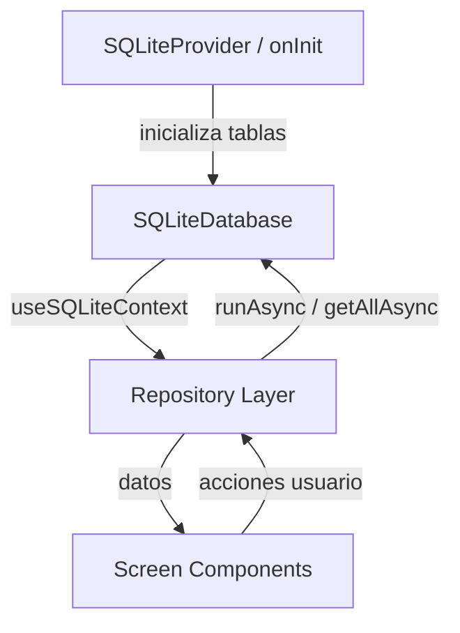
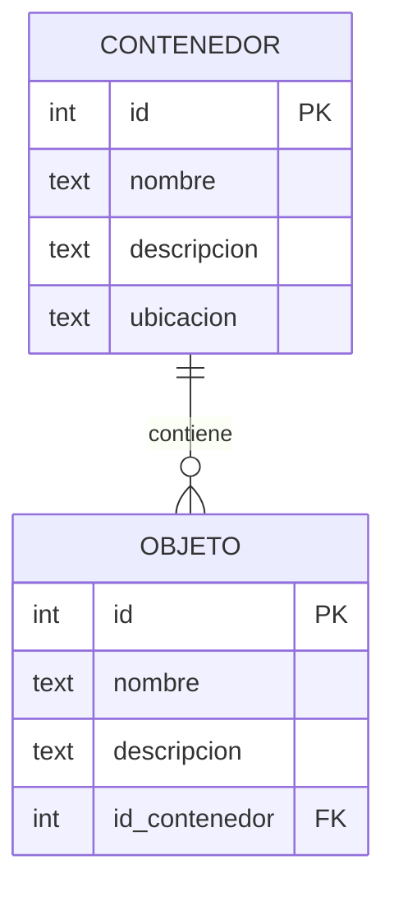

# Design Document — San Alejo App

## Overview

San Alejo es una aplicación móvil offline-first construida con Expo (React Native) que permite a los usuarios inventariar contenedores físicos y los objetos guardados en ellos. El objetivo principal es que el usuario pueda encontrar cualquier objeto sin necesidad de abrir físicamente los contenedores.

### Decisiones de diseño clave

- **Offline-first total**: No hay servidor ni sincronización en la nube. Todos los datos viven en SQLite local mediante `expo-sqlite`.
- **SQLiteProvider + useSQLiteContext**: Se usa el patrón de contexto de React provisto por `expo-sqlite` para compartir la instancia de BD a través del árbol de componentes, evitando pasar la BD como prop.
- **Expo Router (file-based routing)**: La navegación se define mediante la estructura de archivos en `app/`, lo que simplifica la configuración y permite deep-linking nativo.
- **Repository pattern**: La lógica de acceso a datos se encapsula en módulos de repositorio (`contenedorRepository`, `objetoRepository`), separando las queries SQL de los componentes de UI.
- **Validación centralizada**: Un módulo `validator` puro maneja la validación de campos, facilitando las pruebas unitarias.

---

## Architecture

La app sigue una arquitectura en capas:

```
┌─────────────────────────────────────────────┐
│                  UI Layer                    │
│  (Expo Router screens + React components)   │
├─────────────────────────────────────────────┤
│              Business Logic Layer            │
│         (validator, search logic)            │
├─────────────────────────────────────────────┤
│              Data Access Layer               │
│   (contenedorRepository, objetoRepository)  │
├─────────────────────────────────────────────┤
│              Database Layer                  │
│        (expo-sqlite, SQLiteProvider)         │
└─────────────────────────────────────────────┘
```

### Flujo de datos



### Estructura de archivos del proyecto

```
app/
├── _layout.tsx              ← Root layout: SQLiteProvider wrapping
├── index.tsx                ← Lista de contenedores (pantalla principal)
├── contenedor/
│   ├── nuevo.tsx            ← Formulario contenedor (modo creación)
│   ├── [id].tsx             ← Detalle del contenedor
│   ├── editar/
│   │   └── [id].tsx         ← Formulario contenedor (modo edición)
│   └── objeto/
│       ├── nuevo.tsx        ← Formulario objeto (modo creación)
│       └── editar/
│           └── [id].tsx     ← Formulario objeto (modo edición)
└── busqueda.tsx             ← Pantalla de búsqueda

src/
├── db/
│   ├── schema.ts            ← DDL: CREATE TABLE statements
│   ├── contenedorRepository.ts
│   └── objetoRepository.ts
├── utils/
│   └── validator.ts         ← Validación de campos
└── components/
    ├── ContenedorItem.tsx
    ├── ObjetoItem.tsx
    ├── FAB.tsx
    └── ConfirmDialog.tsx
```

---

## Components and Interfaces

### Database Initialization (`src/db/schema.ts`)

```typescript
import { SQLiteDatabase } from 'expo-sqlite';

export async function initializeDatabase(db: SQLiteDatabase): Promise<void> {
  await db.execAsync(`
    PRAGMA journal_mode = WAL;
    PRAGMA foreign_keys = ON;

    CREATE TABLE IF NOT EXISTS contenedor (
      id          INTEGER PRIMARY KEY AUTOINCREMENT,
      nombre      TEXT NOT NULL,
      descripcion TEXT NOT NULL,
      ubicacion   TEXT NOT NULL
    );

    CREATE TABLE IF NOT EXISTS objeto (
      id            INTEGER PRIMARY KEY AUTOINCREMENT,
      nombre        TEXT NOT NULL,
      descripcion   TEXT NOT NULL,
      id_contenedor INTEGER NOT NULL,
      FOREIGN KEY (id_contenedor) REFERENCES contenedor(id) ON DELETE CASCADE
    );
  `);
}
```

> **Nota**: `PRAGMA foreign_keys = ON` debe ejecutarse en cada conexión porque SQLite lo desactiva por defecto. El `onInit` de `SQLiteProvider` es el lugar correcto para esto.

### Root Layout (`app/_layout.tsx`)

```typescript
import { SQLiteProvider } from 'expo-sqlite';
import { Stack } from 'expo-router';
import { Suspense } from 'react';
import { ActivityIndicator, View } from 'react-native';
import { initializeDatabase } from '../src/db/schema';

export default function RootLayout() {
  return (
    <Suspense fallback={<View><ActivityIndicator /></View>}>
      <SQLiteProvider
        databaseName="san-alejo.db"
        onInit={initializeDatabase}
        useSuspense
      >
        <Stack />
      </SQLiteProvider>
    </Suspense>
  );
}
```

### Contenedor Repository (`src/db/contenedorRepository.ts`)

```typescript
import { SQLiteDatabase } from 'expo-sqlite';

export interface Contenedor {
  id: number;
  nombre: string;
  descripcion: string;
  ubicacion: string;
}

export async function getAllContenedores(db: SQLiteDatabase): Promise<Contenedor[]> {
  return db.getAllAsync<Contenedor>(
    'SELECT * FROM contenedor ORDER BY nombre ASC'
  );
}

export async function getContenedorById(db: SQLiteDatabase, id: number): Promise<Contenedor | null> {
  return db.getFirstAsync<Contenedor>(
    'SELECT * FROM contenedor WHERE id = ?', id
  );
}

export async function insertContenedor(
  db: SQLiteDatabase,
  data: Omit<Contenedor, 'id'>
): Promise<number> {
  const result = await db.runAsync(
    'INSERT INTO contenedor (nombre, descripcion, ubicacion) VALUES (?, ?, ?)',
    data.nombre, data.descripcion, data.ubicacion
  );
  return result.lastInsertRowId;
}

export async function updateContenedor(
  db: SQLiteDatabase,
  id: number,
  data: Omit<Contenedor, 'id'>
): Promise<void> {
  await db.runAsync(
    'UPDATE contenedor SET nombre = ?, descripcion = ?, ubicacion = ? WHERE id = ?',
    data.nombre, data.descripcion, data.ubicacion, id
  );
}

export async function deleteContenedor(db: SQLiteDatabase, id: number): Promise<void> {
  await db.runAsync('DELETE FROM contenedor WHERE id = ?', id);
}
```

### Objeto Repository (`src/db/objetoRepository.ts`)

```typescript
import { SQLiteDatabase } from 'expo-sqlite';

export interface Objeto {
  id: number;
  nombre: string;
  descripcion: string;
  id_contenedor: number;
}

export interface ObjetoConContenedor extends Objeto {
  nombre_contenedor: string;
}

export async function getObjetosByContenedor(
  db: SQLiteDatabase,
  id_contenedor: number
): Promise<Objeto[]> {
  return db.getAllAsync<Objeto>(
    'SELECT * FROM objeto WHERE id_contenedor = ? ORDER BY nombre ASC',
    id_contenedor
  );
}

export async function insertObjeto(
  db: SQLiteDatabase,
  data: Omit<Objeto, 'id'>
): Promise<number> {
  const result = await db.runAsync(
    'INSERT INTO objeto (nombre, descripcion, id_contenedor) VALUES (?, ?, ?)',
    data.nombre, data.descripcion, data.id_contenedor
  );
  return result.lastInsertRowId;
}

export async function updateObjeto(
  db: SQLiteDatabase,
  id: number,
  data: Pick<Objeto, 'nombre' | 'descripcion'>
): Promise<void> {
  await db.runAsync(
    'UPDATE objeto SET nombre = ?, descripcion = ? WHERE id = ?',
    data.nombre, data.descripcion, id
  );
}

export async function deleteObjeto(db: SQLiteDatabase, id: number): Promise<void> {
  await db.runAsync('DELETE FROM objeto WHERE id = ?', id);
}

export async function searchObjetos(
  db: SQLiteDatabase,
  query: string
): Promise<ObjetoConContenedor[]> {
  const pattern = `%${query}%`;
  return db.getAllAsync<ObjetoConContenedor>(
    `SELECT o.*, c.nombre AS nombre_contenedor
     FROM objeto o
     JOIN contenedor c ON o.id_contenedor = c.id
     WHERE o.nombre LIKE ? COLLATE NOCASE
        OR o.descripcion LIKE ? COLLATE NOCASE
     ORDER BY o.nombre ASC`,
    pattern, pattern
  );
}
```

### Validator (`src/utils/validator.ts`)

```typescript
export interface ValidationResult {
  valid: boolean;
  errors: Record<string, string>;
}

/**
 * Verifica que todos los campos requeridos tengan contenido no vacío
 * y no compuesto únicamente de espacios en blanco.
 */
export function validateFields(
  fields: Record<string, string>
): ValidationResult {
  const errors: Record<string, string> = {};

  for (const [key, value] of Object.entries(fields)) {
    if (value.trim().length === 0) {
      errors[key] = `El campo "${key}" es obligatorio.`;
    }
  }

  return { valid: Object.keys(errors).length === 0, errors };
}
```

### Navegación (Expo Router)

La navegación usa el stack nativo de Expo Router. Los parámetros se pasan como query params en la URL:

| Ruta | Pantalla | Parámetros |
|------|----------|------------|
| `/` | Lista de contenedores | — |
| `/contenedor/nuevo` | Formulario contenedor (crear) | — |
| `/contenedor/[id]` | Detalle del contenedor | `id` |
| `/contenedor/editar/[id]` | Formulario contenedor (editar) | `id` |
| `/contenedor/objeto/nuevo?id_contenedor=X` | Formulario objeto (crear) | `id_contenedor` |
| `/contenedor/objeto/editar/[id]` | Formulario objeto (editar) | `id` |
| `/busqueda` | Búsqueda global | — |

Navegación programática desde componentes:

```typescript
import { router } from 'expo-router';

// Navegar al detalle
router.push(`/contenedor/${id}`);

// Navegar al formulario de edición
router.push(`/contenedor/editar/${id}`);

// Regresar
router.back();
```

---

## Data Models

### Esquema de base de datos

```sql
-- Tabla de contenedores
CREATE TABLE IF NOT EXISTS contenedor (
  id          INTEGER PRIMARY KEY AUTOINCREMENT,
  nombre      TEXT NOT NULL,
  descripcion TEXT NOT NULL,
  ubicacion   TEXT NOT NULL
);

-- Tabla de objetos
CREATE TABLE IF NOT EXISTS objeto (
  id            INTEGER PRIMARY KEY AUTOINCREMENT,
  nombre        TEXT NOT NULL,
  descripcion   TEXT NOT NULL,
  id_contenedor INTEGER NOT NULL,
  FOREIGN KEY (id_contenedor) REFERENCES contenedor(id) ON DELETE CASCADE
);
```

### Diagrama entidad-relación



### Tipos TypeScript

```typescript
// Entidades de dominio
interface Contenedor {
  id: number;
  nombre: string;
  descripcion: string;
  ubicacion: string;
}

interface Objeto {
  id: number;
  nombre: string;
  descripcion: string;
  id_contenedor: number;
}

// Resultado de búsqueda (join)
interface ObjetoConContenedor extends Objeto {
  nombre_contenedor: string;
}

// Formularios (sin id para creación)
type ContenedorInput = Omit<Contenedor, 'id'>;
type ObjetoInput = Omit<Objeto, 'id'>;
```

### Migración de base de datos

Se usa el patrón de versión con `PRAGMA user_version` para gestionar migraciones futuras:

```typescript
export async function initializeDatabase(db: SQLiteDatabase): Promise<void> {
  const DATABASE_VERSION = 1;
  const { user_version } = await db.getFirstAsync<{ user_version: number }>(
    'PRAGMA user_version'
  );

  if (user_version >= DATABASE_VERSION) return;

  if (user_version === 0) {
    await db.execAsync(`
      PRAGMA journal_mode = WAL;
      PRAGMA foreign_keys = ON;
      CREATE TABLE IF NOT EXISTS contenedor ( ... );
      CREATE TABLE IF NOT EXISTS objeto ( ... );
    `);
  }

  await db.execAsync(`PRAGMA user_version = ${DATABASE_VERSION}`);
}
```

---

## Correctness Properties

*Una propiedad es una característica o comportamiento que debe mantenerse verdadero en todas las ejecuciones válidas del sistema — esencialmente, una declaración formal sobre lo que el sistema debe hacer. Las propiedades sirven como puente entre las especificaciones legibles por humanos y las garantías de corrección verificables por máquinas.*

### Property 1: Ordenamiento de contenedores

*Para cualquier* conjunto de contenedores con nombres arbitrarios almacenados en la base de datos, la función `getAllContenedores` debe retornar la lista ordenada alfabéticamente por nombre de forma ascendente.

**Validates: Requirements 2.1**

---

### Property 2: Completitud de datos en lista de contenedores

*Para cualquier* contenedor con nombre, descripción y ubicación arbitrarios, la representación del ítem en la lista debe incluir los tres campos sin omitir ninguno.

**Validates: Requirements 2.2**

---

### Property 3: Validación de campos obligatorios rechaza whitespace

*Para cualquier* string compuesto únicamente de espacios en blanco (espacios, tabs, saltos de línea) de longitud arbitraria, la función `validateFields` debe rechazarlo como inválido para cualquier campo obligatorio.

**Validates: Requirements 3.3, 5.3**

---

### Property 4: Round-trip de inserción de contenedor

*Para cualquier* conjunto de valores válidos (nombre, descripción, ubicación no vacíos), insertar un contenedor y luego consultarlo por su id debe retornar exactamente los mismos valores ingresados.

**Validates: Requirements 3.5**

---

### Property 5: Round-trip de actualización de contenedor

*Para cualquier* contenedor existente y cualquier conjunto de nuevos valores válidos, actualizar el contenedor y luego consultarlo debe retornar exactamente los nuevos valores.

**Validates: Requirements 3.6**

---

### Property 6: Completitud de datos en detalle de contenedor

*Para cualquier* contenedor con datos arbitrarios, la pantalla de detalle debe mostrar nombre, descripción y ubicación del contenedor, y para cada objeto asociado debe mostrar su nombre y descripción.

**Validates: Requirements 4.1, 4.3**

---

### Property 7: Aislamiento de objetos por contenedor

*Para cualquier* contenedor con N objetos asociados, la función `getObjetosByContenedor` debe retornar exactamente esos N objetos y ningún objeto de otro contenedor.

**Validates: Requirements 4.2**

---

### Property 8: Round-trip de inserción de objeto

*Para cualquier* conjunto de valores válidos (nombre, descripción) y un id_contenedor existente, insertar un objeto y luego consultarlo por su id debe retornar exactamente los mismos valores incluyendo el id_contenedor correcto.

**Validates: Requirements 5.5**

---

### Property 9: Round-trip de actualización de objeto

*Para cualquier* objeto existente y cualquier conjunto de nuevos valores válidos, actualizar el objeto y luego consultarlo debe retornar exactamente los nuevos valores.

**Validates: Requirements 5.6**

---

### Property 10: Eliminación en cascada de objetos al eliminar contenedor

*Para cualquier* contenedor con N objetos (N ≥ 0), eliminar el contenedor debe resultar en que ningún objeto con ese `id_contenedor` exista en la base de datos.

**Validates: Requirements 7.3**

---

### Property 11: Búsqueda case-insensitive retorna todos los coincidentes

*Para cualquier* texto de búsqueda no vacío y cualquier conjunto de objetos en la base de datos, la función `searchObjetos` debe retornar exactamente los objetos cuyo nombre o descripción contengan el texto (ignorando mayúsculas/minúsculas), sin omitir ninguno que debería aparecer ni incluir ninguno que no debería.

**Validates: Requirements 8.2**

---

### Property 12: Resultados de búsqueda incluyen nombre del contenedor

*Para cualquier* resultado de búsqueda, cada objeto retornado debe incluir el nombre del contenedor al que pertenece.

**Validates: Requirements 8.3**

---

### Property 13: Precarga de datos en modo edición

*Para cualquier* contenedor u objeto con datos arbitrarios, abrir el formulario en modo edición debe inicializar los campos con exactamente los valores actuales del registro.

**Validates: Requirements 9.5**

---

## Error Handling

### Estrategia general

Todos los errores de base de datos se capturan con `try/catch` en los repositorios y se propagan como excepciones tipadas hacia los componentes de UI, que los muestran mediante estado local.

```typescript
// Patrón en componentes de pantalla
const [error, setError] = useState<string | null>(null);

async function handleSave() {
  try {
    await insertContenedor(db, formData);
    router.back();
  } catch (e) {
    setError('No se pudo guardar el contenedor. Intenta de nuevo.');
  }
}
```

### Tabla de errores y mensajes

| Escenario | Mensaje al usuario |
|-----------|-------------------|
| BD no puede inicializarse | "No se pudo abrir el almacenamiento local." |
| Fallo al insertar contenedor | "No se pudo guardar el contenedor." |
| Fallo al actualizar contenedor | "No se pudo guardar el contenedor." |
| Fallo al eliminar contenedor | "No se pudo eliminar el contenedor." |
| Fallo al insertar objeto | "No se pudo guardar el objeto." |
| Fallo al actualizar objeto | "No se pudo guardar el objeto." |
| Fallo al eliminar objeto | "No se pudo eliminar el objeto." |
| Campo obligatorio vacío | "El campo '[nombre]' es obligatorio." |

### Error de inicialización de BD

El `SQLiteProvider` acepta una prop `onError` para manejar fallos de inicialización:

```typescript
<SQLiteProvider
  databaseName="san-alejo.db"
  onInit={initializeDatabase}
  onError={(error) => setDbError(error.message)}
  useSuspense
>
```

Si `onError` se dispara, se renderiza un componente de error en lugar de la app.

---

## Testing Strategy

### Enfoque dual

La estrategia combina pruebas de ejemplo (unit tests) para comportamientos específicos y pruebas basadas en propiedades (property-based tests) para verificar invariantes universales.

### Herramientas

| Herramienta | Propósito |
|-------------|-----------|
| **Jest** + **jest-expo** | Runner de tests y mocks de módulos nativos |
| **fast-check** | Librería de property-based testing para TypeScript/JavaScript |
| **@testing-library/react-native** | Renderizado y queries de componentes React Native |

### Pruebas de propiedades (property-based tests)

Se usa [fast-check](https://fast-check.dev/) para generar inputs aleatorios. Cada test de propiedad ejecuta mínimo **100 iteraciones**.

Cada test debe incluir un comentario de trazabilidad:
```
// Feature: san-alejo-app, Property N: <texto de la propiedad>
```

**Módulos bajo prueba con PBT:**

- `src/utils/validator.ts` — Propiedades 3
- `src/db/contenedorRepository.ts` — Propiedades 1, 2, 4, 5
- `src/db/objetoRepository.ts` — Propiedades 7, 8, 9, 10, 11, 12
- Componentes de formulario — Propiedad 13

**Ejemplo de test de propiedad:**

```typescript
import fc from 'fast-check';
import { validateFields } from '../src/utils/validator';

// Feature: san-alejo-app, Property 3: Validación rechaza whitespace
test('validateFields rechaza strings de solo whitespace', () => {
  fc.assert(
    fc.property(
      fc.stringOf(fc.constantFrom(' ', '\t', '\n', '\r')).filter(s => s.length > 0),
      (whitespaceString) => {
        const result = validateFields({ nombre: whitespaceString });
        return result.valid === false && 'nombre' in result.errors;
      }
    ),
    { numRuns: 100 }
  );
});
```

**Ejemplo de test de propiedad con BD en memoria:**

```typescript
import fc from 'fast-check';
import * as SQLite from 'expo-sqlite';
import { insertContenedor, getContenedorById } from '../src/db/contenedorRepository';

// Feature: san-alejo-app, Property 4: Round-trip de inserción de contenedor
test('insertar y consultar contenedor retorna los mismos valores', async () => {
  const db = await SQLite.openDatabaseAsync(':memory:');
  await initializeDatabase(db);

  await fc.assert(
    fc.asyncProperty(
      fc.record({
        nombre: fc.string({ minLength: 1 }).filter(s => s.trim().length > 0),
        descripcion: fc.string({ minLength: 1 }).filter(s => s.trim().length > 0),
        ubicacion: fc.string({ minLength: 1 }).filter(s => s.trim().length > 0),
      }),
      async (data) => {
        const id = await insertContenedor(db, data);
        const retrieved = await getContenedorById(db, id);
        return (
          retrieved !== null &&
          retrieved.nombre === data.nombre &&
          retrieved.descripcion === data.descripcion &&
          retrieved.ubicacion === data.ubicacion
        );
      }
    ),
    { numRuns: 100 }
  );

  await db.closeAsync();
});
```

### Pruebas de ejemplo (unit tests)

Se usan para casos específicos que no son universales:

- Estado vacío (sin contenedores, sin objetos)
- Mensajes de error de UI
- Comportamiento de navegación (con mocks de `expo-router`)
- Diálogos de confirmación (cancelar vs confirmar)
- Manejo de errores de BD (con mocks de repositorios)

### Pruebas de humo (smoke tests)

- Verificar que las tablas `contenedor` y `objeto` se crean correctamente tras `initializeDatabase`
- Verificar que `PRAGMA foreign_keys` está activo

### Organización de archivos de test

```
__tests__/
├── unit/
│   ├── validator.test.ts
│   ├── contenedorRepository.test.ts
│   └── objetoRepository.test.ts
├── components/
│   ├── ContenedorItem.test.tsx
│   ├── ObjetoItem.test.tsx
│   └── ConfirmDialog.test.tsx
├── screens/
│   ├── ListaContenedores.test.tsx
│   ├── DetalleContenedor.test.tsx
│   ├── FormularioContenedor.test.tsx
│   ├── FormularioObjeto.test.tsx
│   └── Busqueda.test.tsx
└── smoke/
    └── database.test.ts
```
