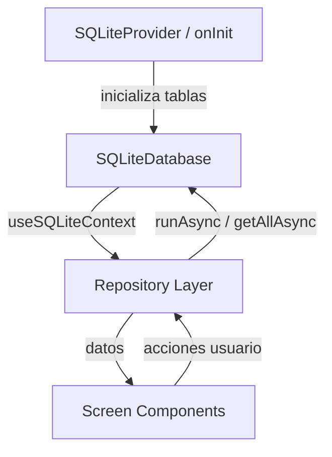
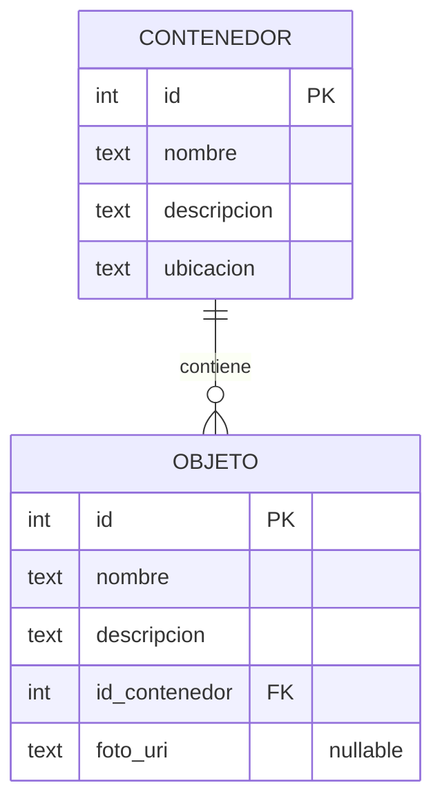

# Design Document — San Alejo App

## Overview

San Alejo es una aplicación móvil offline-first construida con Expo (React Native) que permite a los usuarios inventariar contenedores físicos y los objetos guardados en ellos. El objetivo principal es que el usuario pueda encontrar cualquier objeto sin necesidad de abrir físicamente los contenedores.

### Decisiones de diseño clave

- **Offline-first total**: No hay servidor ni sincronización en la nube. Todos los datos viven en SQLite local mediante `expo-sqlite`.
- **SQLiteProvider + useSQLiteContext**: Se usa el patrón de contexto de React provisto por `expo-sqlite` para compartir la instancia de BD a través del árbol de componentes, evitando pasar la BD como prop.
- **Expo Router (file-based routing)**: La navegación se define mediante la estructura de archivos en `app/`, lo que simplifica la configuración y permite deep-linking nativo.
- **Repository pattern**: La lógica de acceso a datos se encapsula en módulos de repositorio (`contenedorRepository`, `objetoRepository`), separando las queries SQL de los componentes de UI.
- **Validación centralizada**: Un módulo `validator` puro maneja la validación de campos, facilitando las pruebas unitarias.

---

## Architecture

La app sigue una arquitectura en capas:

```
┌─────────────────────────────────────────────┐
│                  UI Layer                    │
│  (Expo Router screens + React components)   │
├─────────────────────────────────────────────┤
│              Business Logic Layer            │
│         (validator, search logic)            │
├─────────────────────────────────────────────┤
│              Data Access Layer               │
│   (contenedorRepository, objetoRepository)  │
├─────────────────────────────────────────────┤
│              Database Layer                  │
│        (expo-sqlite, SQLiteProvider)         │
└─────────────────────────────────────────────┘
```

### Flujo de datos



### Estructura de archivos del proyecto

```
app/
├── _layout.tsx              ← Root layout: SQLiteProvider wrapping
├── index.tsx                ← Lista de contenedores (pantalla principal)
├── contenedor/
│   ├── nuevo.tsx            ← Formulario contenedor (modo creación)
│   ├── [id].tsx             ← Detalle del contenedor
│   ├── editar/
│   │   └── [id].tsx         ← Formulario contenedor (modo edición)
│   └── objeto/
│       ├── nuevo.tsx        ← Formulario objeto (modo creación)
│       └── editar/
│           └── [id].tsx     ← Formulario objeto (modo edición)
└── busqueda.tsx             ← Pantalla de búsqueda

src/
├── db/
│   ├── schema.ts            ← DDL: CREATE TABLE statements + migraciones
│   ├── contenedorRepository.ts
│   └── objetoRepository.ts
├── context/
│   └── ThemeContext.tsx     ← ThemeProvider + useTheme hook
├── utils/
│   ├── validator.ts         ← Validación de campos
│   └── imageStorage.ts      ← Copia y eliminación de archivos de imagen
├── theme.ts                 ← Paletas dark/light, tokens compartidos, resolveTheme
└── components/
    ├── ContenedorItem.tsx
    ├── ObjetoItem.tsx
    ├── FAB.tsx
    ├── ConfirmDialog.tsx
    └── ImagePickerButton.tsx ← Selector/captura de foto con vista previa
```

---

## Components and Interfaces

### Database Initialization (`src/db/schema.ts`)

El código canónico de `initializeDatabase` es el de la sección **Migración de base de datos** más abajo (versión 2 con migraciones incrementales). El fragmento a continuación es solo referencia del DDL inicial; la implementación real debe usar el patrón de `user_version`.

```typescript
import { SQLiteDatabase } from 'expo-sqlite';

// Ver implementación completa en la sección "Migración de base de datos"
export async function initializeDatabase(db: SQLiteDatabase): Promise<void> {
  // DATABASE_VERSION = 2
  // Versión 0 → 1: crea tablas contenedor y objeto (sin foto_uri)
  // Versión 1 → 2: ALTER TABLE objeto ADD COLUMN foto_uri TEXT
}
```

> **Nota**: `PRAGMA foreign_keys = ON` debe ejecutarse en cada conexión porque SQLite lo desactiva por defecto. El `onInit` de `SQLiteProvider` es el lugar correcto para esto.

### Image Storage (`src/utils/imageStorage.ts`)

Módulo puro de utilidades para gestionar archivos de imagen en el sistema de archivos del dispositivo. Todas las operaciones de eliminación son silenciosas ante archivos inexistentes.

```typescript
import * as FileSystem from 'expo-file-system';
import { randomUUID } from 'expo-crypto';

const IMAGES_DIR = FileSystem.documentDirectory + 'images/';

/** Asegura que el directorio de imágenes existe antes de copiar. */
async function ensureImagesDirExists(): Promise<void> {
  const info = await FileSystem.getInfoAsync(IMAGES_DIR);
  if (!info.exists) {
    await FileSystem.makeDirectoryAsync(IMAGES_DIR, { intermediates: true });
  }
}

/**
 * Copia una imagen al directorio persistente de la app.
 * Retorna la ruta de destino (dentro de images/).
 */
export async function copyImageToStorage(sourceUri: string): Promise<string> {
  await ensureImagesDirExists();
  const extension = sourceUri.split('.').pop() ?? 'jpg';
  const destUri = `${IMAGES_DIR}${randomUUID()}.${extension}`;
  await FileSystem.copyAsync({ from: sourceUri, to: destUri });
  return destUri;
}

/**
 * Elimina un archivo de imagen si existe.
 * No lanza error si el archivo no existe.
 */
export async function deleteImageFromStorage(uri: string): Promise<void> {
  const info = await FileSystem.getInfoAsync(uri);
  if (info.exists) {
    await FileSystem.deleteAsync(uri, { idempotent: true });
  }
}

/**
 * Elimina múltiples archivos de imagen (para cascade delete).
 * Ignora archivos que no existen.
 */
export async function deleteImagesFromStorage(uris: string[]): Promise<void> {
  await Promise.all(uris.map(deleteImageFromStorage));
}
```

### ImagePickerButton (`src/components/ImagePickerButton.tsx`)

Componente reutilizable que encapsula la solicitud de permisos y la selección/captura de imagen. Muestra una vista previa si ya hay una imagen seleccionada.

```typescript
import * as ImagePicker from 'expo-image-picker';
import { Image, Pressable, Text, View, StyleSheet } from 'react-native';

interface ImagePickerButtonProps {
  currentUri: string | null;
  onImageSelected: (uri: string) => void;
  onPermissionDenied: () => void;
}

export function ImagePickerButton({
  currentUri,
  onImageSelected,
  onPermissionDenied,
}: ImagePickerButtonProps) {
  async function requestAndLaunch(
    launcher: () => Promise<ImagePicker.ImagePickerResult>
  ) {
    const { status } = await ImagePicker.requestMediaLibraryPermissionsAsync();
    if (status !== 'granted') {
      onPermissionDenied();
      return;
    }
    const result = await launcher();
    if (!result.canceled && result.assets.length > 0) {
      onImageSelected(result.assets[0].uri);
    }
  }

  async function handleGallery() {
    await requestAndLaunch(() =>
      ImagePicker.launchImageLibraryAsync({
        mediaTypes: ImagePicker.MediaTypeOptions.Images,
        allowsEditing: true,
        quality: 0.8,
      })
    );
  }

  async function handleCamera() {
    const { status } = await ImagePicker.requestCameraPermissionsAsync();
    if (status !== 'granted') {
      onPermissionDenied();
      return;
    }
    const result = await ImagePicker.launchCameraAsync({
      mediaTypes: ImagePicker.MediaTypeOptions.Images,
      allowsEditing: true,
      quality: 0.8,
    });
    if (!result.canceled && result.assets.length > 0) {
      onImageSelected(result.assets[0].uri);
    }
  }

  return (
    <View>
      {currentUri ? (
        <Image
          source={{ uri: currentUri }}
          style={styles.preview}
          accessibilityLabel="Vista previa de la foto del objeto"
        />
      ) : null}
      <Pressable
        onPress={handleCamera}
        accessibilityRole="button"
        accessibilityLabel="Tomar foto del objeto"
      >
        <Text>Tomar foto</Text>
      </Pressable>
      <Pressable
        onPress={handleGallery}
        accessibilityRole="button"
        accessibilityLabel="Seleccionar foto de galería"
      >
        <Text>{currentUri ? 'Cambiar foto' : 'Seleccionar de galería'}</Text>
      </Pressable>
    </View>
  );
}

const styles = StyleSheet.create({
  preview: { width: 120, height: 120, borderRadius: 8, marginBottom: 8 },
});
```

### Root Layout (`app/_layout.tsx`)

```typescript
import { SQLiteProvider } from 'expo-sqlite';
import { Stack } from 'expo-router';
import { Suspense } from 'react';
import { ActivityIndicator, View } from 'react-native';
import { initializeDatabase } from '../src/db/schema';

export default function RootLayout() {
  return (
    <Suspense fallback={<View><ActivityIndicator /></View>}>
      <SQLiteProvider
        databaseName="san-alejo.db"
        onInit={initializeDatabase}
        useSuspense
      >
        <Stack />
      </SQLiteProvider>
    </Suspense>
  );
}
```

### Contenedor Repository (`src/db/contenedorRepository.ts`)

```typescript
import { SQLiteDatabase } from 'expo-sqlite';

export interface Contenedor {
  id: number;
  nombre: string;
  descripcion: string;
  ubicacion: string;
}

export async function getAllContenedores(db: SQLiteDatabase): Promise<Contenedor[]> {
  return db.getAllAsync<Contenedor>(
    'SELECT * FROM contenedor ORDER BY nombre ASC'
  );
}

export async function getContenedorById(db: SQLiteDatabase, id: number): Promise<Contenedor | null> {
  return db.getFirstAsync<Contenedor>(
    'SELECT * FROM contenedor WHERE id = ?', id
  );
}

export async function insertContenedor(
  db: SQLiteDatabase,
  data: Omit<Contenedor, 'id'>
): Promise<number> {
  const result = await db.runAsync(
    'INSERT INTO contenedor (nombre, descripcion, ubicacion) VALUES (?, ?, ?)',
    data.nombre, data.descripcion, data.ubicacion
  );
  return result.lastInsertRowId;
}

export async function updateContenedor(
  db: SQLiteDatabase,
  id: number,
  data: Omit<Contenedor, 'id'>
): Promise<void> {
  await db.runAsync(
    'UPDATE contenedor SET nombre = ?, descripcion = ?, ubicacion = ? WHERE id = ?',
    data.nombre, data.descripcion, data.ubicacion, id
  );
}

export async function deleteContenedor(db: SQLiteDatabase, id: number): Promise<void> {
  await db.runAsync('DELETE FROM contenedor WHERE id = ?', id);
}
```

### Objeto Repository (`src/db/objetoRepository.ts`)

```typescript
import { SQLiteDatabase } from 'expo-sqlite';

export interface Objeto {
  id: number;
  nombre: string;
  descripcion: string;
  id_contenedor: number;
  foto_uri: string | null;
}

export interface ObjetoConContenedor extends Objeto {
  nombre_contenedor: string;
}

export async function getObjetosByContenedor(
  db: SQLiteDatabase,
  id_contenedor: number
): Promise<Objeto[]> {
  return db.getAllAsync<Objeto>(
    'SELECT * FROM objeto WHERE id_contenedor = ? ORDER BY nombre ASC',
    id_contenedor
  );
}

export async function getObjetoById(
  db: SQLiteDatabase,
  id: number
): Promise<Objeto | null> {
  return db.getFirstAsync<Objeto>(
    'SELECT * FROM objeto WHERE id = ?', id
  );
}

export async function insertObjeto(
  db: SQLiteDatabase,
  data: Omit<Objeto, 'id'>
): Promise<number> {
  const result = await db.runAsync(
    'INSERT INTO objeto (nombre, descripcion, id_contenedor, foto_uri) VALUES (?, ?, ?, ?)',
    data.nombre, data.descripcion, data.id_contenedor, data.foto_uri
  );
  return result.lastInsertRowId;
}

export async function updateObjeto(
  db: SQLiteDatabase,
  id: number,
  data: Pick<Objeto, 'nombre' | 'descripcion' | 'foto_uri'>
): Promise<void> {
  await db.runAsync(
    'UPDATE objeto SET nombre = ?, descripcion = ?, foto_uri = ? WHERE id = ?',
    data.nombre, data.descripcion, data.foto_uri, id
  );
}

export async function deleteObjeto(db: SQLiteDatabase, id: number): Promise<void> {
  await db.runAsync('DELETE FROM objeto WHERE id = ?', id);
}

/**
 * Retorna todas las rutas de foto no nulas de los objetos de un contenedor.
 * Se usa para limpiar archivos en cascada antes de eliminar el contenedor.
 */
export async function getObjetosFotoUriByContenedor(
  db: SQLiteDatabase,
  id_contenedor: number
): Promise<string[]> {
  const rows = await db.getAllAsync<{ foto_uri: string }>(
    'SELECT foto_uri FROM objeto WHERE id_contenedor = ? AND foto_uri IS NOT NULL',
    id_contenedor
  );
  return rows.map(r => r.foto_uri);
}

export async function searchObjetos(
  db: SQLiteDatabase,
  query: string
): Promise<ObjetoConContenedor[]> {
  const pattern = `%${query}%`;
  return db.getAllAsync<ObjetoConContenedor>(
    `SELECT o.*, c.nombre AS nombre_contenedor
     FROM objeto o
     JOIN contenedor c ON o.id_contenedor = c.id
     WHERE o.nombre LIKE ? COLLATE NOCASE
        OR o.descripcion LIKE ? COLLATE NOCASE
     ORDER BY o.nombre ASC`,
    pattern, pattern
  );
}
```

### Validator (`src/utils/validator.ts`)

```typescript
export interface ValidationResult {
  valid: boolean;
  errors: Record<string, string>;
}

/**
 * Verifica que todos los campos requeridos tengan contenido no vacío
 * y no compuesto únicamente de espacios en blanco.
 */
export function validateFields(
  fields: Record<string, string>
): ValidationResult {
  const errors: Record<string, string> = {};

  for (const [key, value] of Object.entries(fields)) {
    if (value.trim().length === 0) {
      errors[key] = `El campo "${key}" es obligatorio.`;
    }
  }

  return { valid: Object.keys(errors).length === 0, errors };
}
```

### Navegación (Expo Router)

La navegación usa el stack nativo de Expo Router. Los parámetros se pasan como query params en la URL:

| Ruta | Pantalla | Parámetros |
|------|----------|------------|
| `/` | Lista de contenedores | — |
| `/contenedor/nuevo` | Formulario contenedor (crear) | — |
| `/contenedor/[id]` | Detalle del contenedor | `id` |
| `/contenedor/editar/[id]` | Formulario contenedor (editar) | `id` |
| `/contenedor/objeto/nuevo?id_contenedor=X` | Formulario objeto (crear) | `id_contenedor` |
| `/contenedor/objeto/editar/[id]` | Formulario objeto (editar) | `id` |
| `/busqueda` | Búsqueda global | — |

Navegación programática desde componentes:

```typescript
import { router } from 'expo-router';

// Navegar al detalle
router.push(`/contenedor/${id}`);

// Navegar al formulario de edición
router.push(`/contenedor/editar/${id}`);

// Regresar
router.back();
```

---

## Data Models

### Esquema de base de datos

```sql
-- Tabla de contenedores
CREATE TABLE IF NOT EXISTS contenedor (
  id          INTEGER PRIMARY KEY AUTOINCREMENT,
  nombre      TEXT NOT NULL,
  descripcion TEXT NOT NULL,
  ubicacion   TEXT NOT NULL
);

-- Tabla de objetos (versión 2: incluye foto_uri)
CREATE TABLE IF NOT EXISTS objeto (
  id            INTEGER PRIMARY KEY AUTOINCREMENT,
  nombre        TEXT NOT NULL,
  descripcion   TEXT NOT NULL,
  id_contenedor INTEGER NOT NULL,
  foto_uri      TEXT,
  FOREIGN KEY (id_contenedor) REFERENCES contenedor(id) ON DELETE CASCADE
);
```

### Diagrama entidad-relación



### Tipos TypeScript

```typescript
// Entidades de dominio
interface Contenedor {
  id: number;
  nombre: string;
  descripcion: string;
  ubicacion: string;
}

interface Objeto {
  id: number;
  nombre: string;
  descripcion: string;
  id_contenedor: number;
  foto_uri: string | null;
}

// Resultado de búsqueda (join)
interface ObjetoConContenedor extends Objeto {
  nombre_contenedor: string;
}

// Formularios (sin id para creación)
type ContenedorInput = Omit<Contenedor, 'id'>;
type ObjetoInput = Omit<Objeto, 'id'>;
```

### Migración de base de datos

Se usa el patrón de versión con `PRAGMA user_version` para gestionar migraciones incrementales. La versión 1 crea las tablas base; la versión 2 agrega la columna `foto_uri` a `objeto` mediante `ALTER TABLE`.

```typescript
export async function initializeDatabase(db: SQLiteDatabase): Promise<void> {
  const DATABASE_VERSION = 2;

  await db.execAsync('PRAGMA foreign_keys = ON;');

  const { user_version } = await db.getFirstAsync<{ user_version: number }>(
    'PRAGMA user_version'
  ) ?? { user_version: 0 };

  if (user_version >= DATABASE_VERSION) return;

  if (user_version === 0) {
    await db.execAsync(`
      PRAGMA journal_mode = WAL;
      CREATE TABLE IF NOT EXISTS contenedor (
        id          INTEGER PRIMARY KEY AUTOINCREMENT,
        nombre      TEXT NOT NULL,
        descripcion TEXT NOT NULL,
        ubicacion   TEXT NOT NULL
      );
      CREATE TABLE IF NOT EXISTS objeto (
        id            INTEGER PRIMARY KEY AUTOINCREMENT,
        nombre        TEXT NOT NULL,
        descripcion   TEXT NOT NULL,
        id_contenedor INTEGER NOT NULL,
        FOREIGN KEY (id_contenedor) REFERENCES contenedor(id) ON DELETE CASCADE
      );
    `);
  }

  if (user_version < 2) {
    // Migración 1 → 2: agregar columna foto_uri (nullable)
    await db.execAsync(
      'ALTER TABLE objeto ADD COLUMN foto_uri TEXT;'
    );
  }

  await db.execAsync(`PRAGMA user_version = ${DATABASE_VERSION};`);
}
```

> **Nota**: `ALTER TABLE ... ADD COLUMN` en SQLite solo permite agregar columnas al final de la tabla y no admite `NOT NULL` sin valor por defecto. La columna `foto_uri TEXT` (nullable) cumple ambas restricciones. Los registros existentes quedan con `foto_uri = null` automáticamente.

---

## Theme System (Requirement 11)

### Overview del sistema de temas

El sistema de temas permite que la app detecte automáticamente el esquema de color del dispositivo (`dark` o `light`) y aplique la paleta correspondiente a todos los componentes sin requerir reinicio. Se basa en tres piezas:

1. **`src/theme.ts`** — Paletas de color `dark` y `light` + tokens compartidos (tipografía, espaciado, radios, sombras)
2. **`src/context/ThemeContext.tsx`** — `ThemeProvider` y hook `useTheme`
3. **`app/_layout.tsx`** — Integración de `ThemeProvider` con `useColorScheme` y `SQLiteProvider`

### Decisiones de diseño

- **Dark-first preservado**: Los tokens actuales de `Colors` se convierten en la paleta `dark`. No se rompe ningún código existente que importe `Colors` directamente (se mantiene como alias de `darkColors` para compatibilidad durante la migración).
- **Contexto React puro**: Se usa `React.createContext` + `useColorScheme` de React Native. No se introduce ninguna librería de theming externa.
- **Tokens compartidos**: `Typography`, `Radii`, `Spacing` y `Shadows` son independientes del tema y no se duplican.
- **Acento índigo invariante**: `#6366F1` se mantiene igual en ambos temas. Solo se ajusta la opacidad en superficies donde el contraste lo requiera.
- **Fallback a `light`**: Si `useColorScheme` retorna `null` o `undefined`, se aplica el tema `light`.

### Interfaces TypeScript

```typescript
// src/theme.ts

/** Paleta de colores para un tema (dark o light) */
export interface ThemeColors {
  // Fondos
  bgBase: string;
  bgSurface: string;
  bgElevated: string;
  bgMuted: string;

  // Acento — Indigo (invariante entre temas)
  accent: string;
  accentLight: string;
  accentDark: string;
  accentMuted: string;

  // Semánticos
  danger: string;
  dangerMuted: string;
  dangerDark: string;
  success: string;
  warning: string;

  // Texto
  textPrimary: string;
  textSecondary: string;
  textMuted: string;
  textOnAccent: string;
  textOnDanger: string;

  // Bordes
  border: string;
  borderSubtle: string;
  borderFocus: string;

  // Overlay
  overlay: string;
}

/** Variante de tema: oscuro o claro */
export type ColorScheme = 'dark' | 'light';

/** Objeto de tema completo expuesto por useTheme */
export interface Theme {
  colors: ThemeColors;
  scheme: ColorScheme;
}
```

### Paletas de color

```typescript
// src/theme.ts

export const darkColors: ThemeColors = {
  // Fondos
  bgBase: '#0F172A',
  bgSurface: '#1E293B',
  bgElevated: '#273549',
  bgMuted: '#334155',

  // Acento
  accent: '#6366F1',
  accentLight: '#818CF8',
  accentDark: '#4F46E5',
  accentMuted: 'rgba(99,102,241,0.15)',

  // Semánticos
  danger: '#EF4444',
  dangerMuted: 'rgba(239,68,68,0.15)',
  dangerDark: '#DC2626',
  success: '#22C55E',
  warning: '#F59E0B',

  // Texto
  textPrimary: '#F1F5F9',
  textSecondary: '#94A3B8',
  textMuted: '#64748B',
  textOnAccent: '#FFFFFF',
  textOnDanger: '#FFFFFF',

  // Bordes
  border: '#1E293B',
  borderSubtle: 'rgba(255,255,255,0.06)',
  borderFocus: '#6366F1',

  // Overlay
  overlay: 'rgba(0,0,0,0.65)',
};

export const lightColors: ThemeColors = {
  // Fondos (alta luminosidad, mínimo #F8FAFC para bgBase)
  bgBase: '#F8FAFC',
  bgSurface: '#FFFFFF',
  bgElevated: '#F1F5F9',
  bgMuted: '#E2E8F0',

  // Acento (invariante)
  accent: '#6366F1',
  accentLight: '#818CF8',
  accentDark: '#4F46E5',
  accentMuted: 'rgba(99,102,241,0.12)',

  // Semánticos
  danger: '#DC2626',
  dangerMuted: 'rgba(220,38,38,0.10)',
  dangerDark: '#B91C1C',
  success: '#16A34A',
  warning: '#D97706',

  // Texto (contraste ≥ 4.5:1 sobre fondos light según WCAG AA)
  textPrimary: '#0F172A',   // contraste ~17:1 sobre #F8FAFC
  textSecondary: '#475569', // contraste ~5.9:1 sobre #F8FAFC
  textMuted: '#64748B',     // contraste ~4.6:1 sobre #F8FAFC
  textOnAccent: '#FFFFFF',
  textOnDanger: '#FFFFFF',

  // Bordes
  border: '#E2E8F0',
  borderSubtle: 'rgba(0,0,0,0.06)',
  borderFocus: '#6366F1',

  // Overlay
  overlay: 'rgba(0,0,0,0.45)',
};

// Alias de compatibilidad (dark-first, para código existente)
export const Colors = darkColors;

export const darkTheme: Theme = { colors: darkColors, scheme: 'dark' };
export const lightTheme: Theme = { colors: lightColors, scheme: 'light' };

/** Selecciona el tema según el esquema del sistema. Fallback: light. */
export function resolveTheme(colorScheme: string | null | undefined): Theme {
  return colorScheme === 'dark' ? darkTheme : lightTheme;
}
```

### ThemeContext (`src/context/ThemeContext.tsx`)

```typescript
import React, { createContext, useContext } from 'react';
import { useColorScheme } from 'react-native';
import { Theme, resolveTheme } from '../theme';

const ThemeContext = createContext<Theme | undefined>(undefined);

/** Provee el tema activo a todos los componentes descendientes. */
export function ThemeProvider({ children }: { children: React.ReactNode }) {
  const colorScheme = useColorScheme();
  const theme = resolveTheme(colorScheme);

  return (
    <ThemeContext.Provider value={theme}>
      {children}
    </ThemeContext.Provider>
  );
}

/**
 * Hook para acceder al tema activo desde cualquier componente.
 * Debe usarse dentro del árbol de ThemeProvider.
 */
export function useTheme(): Theme {
  const theme = useContext(ThemeContext);
  if (theme === undefined) {
    throw new Error('useTheme debe usarse dentro de ThemeProvider');
  }
  return theme;
}
```

### Root Layout actualizado (`app/_layout.tsx`)

```typescript
import { SQLiteProvider } from 'expo-sqlite';
import { Stack } from 'expo-router';
import { StatusBar } from 'expo-status-bar';
import { Suspense } from 'react';
import { ActivityIndicator, View } from 'react-native';
import { initializeDatabase } from '../src/db/schema';
import { ThemeProvider, useTheme } from '../src/context/ThemeContext';
import { Typography } from '../src/theme';

function AppNavigator() {
  const { colors, scheme } = useTheme();

  return (
    <>
      <StatusBar style={scheme === 'dark' ? 'light' : 'dark'} />
      <Stack
        screenOptions={{
          headerStyle: { backgroundColor: colors.bgSurface },
          headerTintColor: colors.textPrimary,
          headerTitleStyle: {
            color: colors.textPrimary,
            fontWeight: Typography.semibold,
            fontSize: Typography.md,
          },
          contentStyle: { backgroundColor: colors.bgBase },
          headerShadowVisible: false,
        }}
      />
    </>
  );
}

export default function RootLayout() {
  return (
    <ThemeProvider>
      <Suspense fallback={<View><ActivityIndicator /></View>}>
        <SQLiteProvider
          databaseName="san-alejo.db"
          onInit={initializeDatabase}
          useSuspense
        >
          <AppNavigator />
        </SQLiteProvider>
      </Suspense>
    </ThemeProvider>
  );
}
```

> **Nota**: `AppNavigator` es un componente separado para poder llamar `useTheme()` dentro del árbol de `ThemeProvider`. El `ThemeProvider` envuelve todo, incluyendo `SQLiteProvider`, para que los componentes de pantalla puedan acceder al tema sin importar su posición en el árbol.

### Patrón de uso en componentes

Todos los componentes y pantallas reemplazan las referencias estáticas a `Colors` por el hook `useTheme`:

```typescript
// Antes (hardcoded dark)
import { Colors } from '../theme';
const styles = StyleSheet.create({
  card: { backgroundColor: Colors.bgSurface },
});

// Después (theme-aware)
import { useTheme } from '../context/ThemeContext';

export function MiComponente() {
  const { colors } = useTheme();
  return <View style={{ backgroundColor: colors.bgSurface }} />;
}
```

Para componentes con estilos complejos, se recomienda calcular los estilos dentro del componente usando `useMemo` o directamente en el render:

```typescript
export function ContenedorItem({ contenedor, onPress, onDelete }: ContenedorItemProps) {
  const { colors } = useTheme();

  return (
    <View style={[styles.card, { backgroundColor: colors.bgSurface }]}>
      {/* ... */}
    </View>
  );
}
```

### Diagrama de flujo del sistema de temas

```mermaid
graph TD
    OS[Sistema Operativo] -->|useColorScheme| UC[useColorScheme hook]
    UC -->|'dark' | 'light' | null| TP[ThemeProvider]
    TP -->|resolveTheme| TH[Theme activo]
    TH -->|ThemeContext.Provider| CTX[React Context]
    CTX -->|useTheme| C1[Lista_Contenedores]
    CTX -->|useTheme| C2[Detalle_Contenedor]
    CTX -->|useTheme| C3[Formulario_Contenedor]
    CTX -->|useTheme| C4[Formulario_Objeto]
    CTX -->|useTheme| C5[Componentes reutilizables]
    CTX -->|scheme| SB[StatusBar style]
    CTX -->|colors| NAV[Stack header colors]
```

---

## Correctness Properties

*Una propiedad es una característica o comportamiento que debe mantenerse verdadero en todas las ejecuciones válidas del sistema — esencialmente, una declaración formal sobre lo que el sistema debe hacer. Las propiedades sirven como puente entre las especificaciones legibles por humanos y las garantías de corrección verificables por máquinas.*

### Property 1: Ordenamiento de contenedores

*Para cualquier* conjunto de contenedores con nombres arbitrarios almacenados en la base de datos, la función `getAllContenedores` debe retornar la lista ordenada alfabéticamente por nombre de forma ascendente.

**Validates: Requirements 2.1**

---

### Property 2: Completitud de datos en lista de contenedores

*Para cualquier* contenedor con nombre, descripción y ubicación arbitrarios, la representación del ítem en la lista debe incluir los tres campos sin omitir ninguno.

**Validates: Requirements 2.2**

---

### Property 3: Validación de campos obligatorios rechaza whitespace

*Para cualquier* string compuesto únicamente de espacios en blanco (espacios, tabs, saltos de línea) de longitud arbitraria, la función `validateFields` debe rechazarlo como inválido para cualquier campo obligatorio.

**Validates: Requirements 3.3, 5.3**

---

### Property 4: Round-trip de inserción de contenedor

*Para cualquier* conjunto de valores válidos (nombre, descripción, ubicación no vacíos), insertar un contenedor y luego consultarlo por su id debe retornar exactamente los mismos valores ingresados.

**Validates: Requirements 3.5**

---

### Property 5: Round-trip de actualización de contenedor

*Para cualquier* contenedor existente y cualquier conjunto de nuevos valores válidos, actualizar el contenedor y luego consultarlo debe retornar exactamente los nuevos valores.

**Validates: Requirements 3.6**

---

### Property 6: Completitud de datos en detalle de contenedor

*Para cualquier* contenedor con datos arbitrarios, la pantalla de detalle debe mostrar nombre, descripción y ubicación del contenedor, y para cada objeto asociado debe mostrar su nombre y descripción.

**Validates: Requirements 4.1, 4.3**

---

### Property 7: Aislamiento de objetos por contenedor

*Para cualquier* contenedor con N objetos asociados, la función `getObjetosByContenedor` debe retornar exactamente esos N objetos y ningún objeto de otro contenedor.

**Validates: Requirements 4.2**

---

### Property 8: Round-trip de inserción de objeto

*Para cualquier* conjunto de valores válidos (nombre, descripción) y un id_contenedor existente, insertar un objeto y luego consultarlo por su id debe retornar exactamente los mismos valores incluyendo el id_contenedor correcto.

**Validates: Requirements 5.5**

---

### Property 9: Round-trip de actualización de objeto

*Para cualquier* objeto existente y cualquier conjunto de nuevos valores válidos, actualizar el objeto y luego consultarlo debe retornar exactamente los nuevos valores.

**Validates: Requirements 5.6**

---

### Property 10: Eliminación en cascada de objetos al eliminar contenedor

*Para cualquier* contenedor con N objetos (N ≥ 0), eliminar el contenedor debe resultar en que ningún objeto con ese `id_contenedor` exista en la base de datos.

**Validates: Requirements 7.3**

---

### Property 11: Búsqueda case-insensitive retorna todos los coincidentes

*Para cualquier* texto de búsqueda no vacío y cualquier conjunto de objetos en la base de datos, la función `searchObjetos` debe retornar exactamente los objetos cuyo nombre o descripción contengan el texto (ignorando mayúsculas/minúsculas), sin omitir ninguno que debería aparecer ni incluir ninguno que no debería.

**Validates: Requirements 8.2**

---

### Property 12: Resultados de búsqueda incluyen nombre del contenedor

*Para cualquier* resultado de búsqueda, cada objeto retornado debe incluir el nombre del contenedor al que pertenece.

**Validates: Requirements 8.3**

---

### Property 13: Precarga de datos en modo edición

*Para cualquier* contenedor u objeto con datos arbitrarios, abrir el formulario en modo edición debe inicializar los campos con exactamente los valores actuales del registro, incluyendo `foto_uri` cuando corresponda.

**Validates: Requirements 9.5, 10.8**

---

### Property 14: Round-trip de foto en objeto

*Para cualquier* objeto con `foto_uri` (incluyendo `null`), insertar el objeto y luego consultarlo por su id debe retornar exactamente la misma ruta de foto (o `null`) que fue persistida.

**Validates: Requirements 10.5, 10.6**

---

### Property 15: Limpieza de archivo al eliminar objeto con foto

*Para cualquier* objeto cuyo `foto_uri` no es null, al eliminar ese objeto la función `deleteImageFromStorage` debe ser invocada con esa ruta, de modo que el archivo ya no exista en el FileSystem tras la operación.

**Validates: Requirements 10.9**

---

### Property 16: Limpieza en cascada de fotos al eliminar contenedor

*Para cualquier* contenedor con N objetos que tienen `foto_uri` no nulos, al eliminar el contenedor la función `deleteImagesFromStorage` debe ser invocada con todas las rutas de imagen, de modo que ningún archivo de imagen de esos objetos persista en el FileSystem.

**Validates: Requirements 10.10**

---

### Property 17: Contraste WCAG AA en el tema light

*Para cualquier* par (color de texto, color de fondo) definido en la paleta `lightColors` de `src/theme.ts`, el ratio de contraste calculado según la fórmula WCAG 2.1 debe ser mayor o igual a 4.5:1.

**Validates: Requirements 11.5**

---

### Property 18: Invariancia del color de acento en ambos temas

*Para cualquier* tema válido (`darkTheme` o `lightTheme`), el valor de `theme.colors.accent` debe ser exactamente `'#6366F1'`.

**Validates: Requirements 11.13**

---

## Error Handling

### Estrategia general

Todos los errores de base de datos se capturan con `try/catch` en los repositorios y se propagan como excepciones tipadas hacia los componentes de UI, que los muestran mediante estado local.

```typescript
// Patrón en componentes de pantalla
const [error, setError] = useState<string | null>(null);

async function handleSave() {
  try {
    await insertContenedor(db, formData);
    router.back();
  } catch (e) {
    setError('No se pudo guardar el contenedor. Intenta de nuevo.');
  }
}
```

### Tabla de errores y mensajes

| Escenario | Mensaje al usuario |
|-----------|-------------------|
| BD no puede inicializarse | "No se pudo abrir el almacenamiento local." |
| Fallo al insertar contenedor | "No se pudo guardar el contenedor." |
| Fallo al actualizar contenedor | "No se pudo guardar el contenedor." |
| Fallo al eliminar contenedor | "No se pudo eliminar el contenedor." |
| Fallo al insertar objeto | "No se pudo guardar el objeto." |
| Fallo al actualizar objeto | "No se pudo guardar el objeto." |
| Fallo al eliminar objeto | "No se pudo eliminar el objeto." |
| Campo obligatorio vacío | "El campo '[nombre]' es obligatorio." |
| Permiso de cámara/galería denegado | "Debes conceder permiso de acceso a la galería o cámara en la configuración del dispositivo." |
| FileSystem falla al copiar imagen | "No se pudo procesar la foto. El objeto se guardará sin imagen." |
| FileSystem falla al eliminar imagen | "No se pudo eliminar el archivo de imagen, pero el objeto fue eliminado." |

### Error de inicialización de BD

El `SQLiteProvider` acepta una prop `onError` para manejar fallos de inicialización:

```typescript
<SQLiteProvider
  databaseName="san-alejo.db"
  onInit={initializeDatabase}
  onError={(error) => setDbError(error.message)}
  useSuspense
>
```

Si `onError` se dispara, se renderiza un componente de error en lugar de la app.

---

## Testing Strategy

### Enfoque dual

La estrategia combina pruebas de ejemplo (unit tests) para comportamientos específicos y pruebas basadas en propiedades (property-based tests) para verificar invariantes universales.

### Herramientas

| Herramienta | Propósito |
|-------------|-----------|
| **Jest** + **jest-expo** | Runner de tests y mocks de módulos nativos |
| **fast-check** | Librería de property-based testing para TypeScript/JavaScript |
| **@testing-library/react-native** | Renderizado y queries de componentes React Native |

### Mocks de módulos nativos

Además del mock existente de `expo-sqlite`, se requieren mocks para los módulos de imagen:

```javascript
// __mocks__/expo-file-system.js
module.exports = {
  documentDirectory: 'file:///data/user/0/com.app/files/',
  getInfoAsync: jest.fn().mockResolvedValue({ exists: false }),
  makeDirectoryAsync: jest.fn().mockResolvedValue(undefined),
  copyAsync: jest.fn().mockResolvedValue(undefined),
  deleteAsync: jest.fn().mockResolvedValue(undefined),
};

// __mocks__/expo-image-picker.js
module.exports = {
  requestMediaLibraryPermissionsAsync: jest.fn().mockResolvedValue({ status: 'granted' }),
  requestCameraPermissionsAsync: jest.fn().mockResolvedValue({ status: 'granted' }),
  launchImageLibraryAsync: jest.fn().mockResolvedValue({ canceled: true, assets: [] }),
  launchCameraAsync: jest.fn().mockResolvedValue({ canceled: true, assets: [] }),
  MediaTypeOptions: { Images: 'Images' },
};
```

### Pruebas de propiedades (property-based tests)

Se usa [fast-check](https://fast-check.dev/) para generar inputs aleatorios. Cada test de propiedad ejecuta mínimo **100 iteraciones**.

Cada test debe incluir un comentario de trazabilidad:
```
// Feature: san-alejo-app, Property N: <texto de la propiedad>
```

**Módulos bajo prueba con PBT:**

- `src/utils/validator.ts` — Propiedades 3
- `src/db/contenedorRepository.ts` — Propiedades 1, 2, 4, 5
- `src/db/objetoRepository.ts` — Propiedades 7, 8, 9, 10, 11, 12, 14
- `src/utils/imageStorage.ts` — Propiedades 15, 16
- Componentes de formulario — Propiedad 13
- `src/theme.ts` — Propiedades 17, 18

**Ejemplo de test de propiedad:**

```typescript
import fc from 'fast-check';
import { validateFields } from '../src/utils/validator';

// Feature: san-alejo-app, Property 3: Validación rechaza whitespace
test('validateFields rechaza strings de solo whitespace', () => {
  fc.assert(
    fc.property(
      fc.stringOf(fc.constantFrom(' ', '\t', '\n', '\r')).filter(s => s.length > 0),
      (whitespaceString) => {
        const result = validateFields({ nombre: whitespaceString });
        return result.valid === false && 'nombre' in result.errors;
      }
    ),
    { numRuns: 100 }
  );
});
```

**Ejemplo de test de propiedad con BD en memoria:**

```typescript
import fc from 'fast-check';
import * as SQLite from 'expo-sqlite';
import { insertContenedor, getContenedorById } from '../src/db/contenedorRepository';

// Feature: san-alejo-app, Property 4: Round-trip de inserción de contenedor
test('insertar y consultar contenedor retorna los mismos valores', async () => {
  const db = await SQLite.openDatabaseAsync(':memory:');
  await initializeDatabase(db);

  await fc.assert(
    fc.asyncProperty(
      fc.record({
        nombre: fc.string({ minLength: 1 }).filter(s => s.trim().length > 0),
        descripcion: fc.string({ minLength: 1 }).filter(s => s.trim().length > 0),
        ubicacion: fc.string({ minLength: 1 }).filter(s => s.trim().length > 0),
      }),
      async (data) => {
        const id = await insertContenedor(db, data);
        const retrieved = await getContenedorById(db, id);
        return (
          retrieved !== null &&
          retrieved.nombre === data.nombre &&
          retrieved.descripcion === data.descripcion &&
          retrieved.ubicacion === data.ubicacion
        );
      }
    ),
    { numRuns: 100 }
  );

  await db.closeAsync();
});
```

**Ejemplo de test de propiedad para el sistema de temas:**

```typescript
import fc from 'fast-check';
import { darkTheme, lightTheme, Theme } from '../src/theme';

// Función auxiliar para calcular luminancia relativa WCAG
function relativeLuminance(hex: string): number {
  const r = parseInt(hex.slice(1, 3), 16) / 255;
  const g = parseInt(hex.slice(3, 5), 16) / 255;
  const b = parseInt(hex.slice(5, 7), 16) / 255;
  const toLinear = (c: number) => c <= 0.03928 ? c / 12.92 : Math.pow((c + 0.055) / 1.055, 2.4);
  return 0.2126 * toLinear(r) + 0.7152 * toLinear(g) + 0.0722 * toLinear(b);
}

function contrastRatio(hex1: string, hex2: string): number {
  const l1 = relativeLuminance(hex1);
  const l2 = relativeLuminance(hex2);
  const lighter = Math.max(l1, l2);
  const darker = Math.min(l1, l2);
  return (lighter + 0.05) / (darker + 0.05);
}

// Feature: dark-mode-support, Property 17: Contraste WCAG AA en el tema light
test('todos los pares texto/fondo del tema light tienen contraste ≥ 4.5:1', () => {
  const { colors } = lightTheme;
  const textColors = [colors.textPrimary, colors.textSecondary, colors.textMuted];
  const bgColors = [colors.bgBase, colors.bgSurface, colors.bgElevated];

  for (const text of textColors) {
    for (const bg of bgColors) {
      const ratio = contrastRatio(text, bg);
      expect(ratio).toBeGreaterThanOrEqual(4.5);
    }
  }
});

// Feature: dark-mode-support, Property 18: Invariancia del color de acento
test('el color de acento es #6366F1 en ambos temas', () => {
  const themes: Theme[] = [darkTheme, lightTheme];
  fc.assert(
    fc.property(
      fc.constantFrom(...themes),
      (theme) => theme.colors.accent === '#6366F1'
    ),
    { numRuns: 100 }
  );
});
```

### Pruebas de ejemplo para el sistema de temas

```typescript
import { render } from '@testing-library/react-native';
import { Text } from 'react-native';
import { ThemeProvider, useTheme } from '../src/context/ThemeContext';
import { resolveTheme, darkTheme, lightTheme } from '../src/theme';

// 11.1 y 11.14: Selección de tema según esquema del sistema
describe('resolveTheme', () => {
  test('retorna darkTheme cuando colorScheme es "dark"', () => {
    expect(resolveTheme('dark')).toBe(darkTheme);
  });
  test('retorna lightTheme cuando colorScheme es "light"', () => {
    expect(resolveTheme('light')).toBe(lightTheme);
  });
  test('retorna lightTheme cuando colorScheme es null (fallback)', () => {
    expect(resolveTheme(null)).toBe(lightTheme);
  });
  test('retorna lightTheme cuando colorScheme es undefined (fallback)', () => {
    expect(resolveTheme(undefined)).toBe(lightTheme);
  });
});

// 11.3: ThemeProvider expone el tema mediante useTheme
test('useTheme retorna el tema activo dentro de ThemeProvider', () => {
  let capturedTheme: ReturnType<typeof useTheme> | null = null;
  function Consumer() {
    capturedTheme = useTheme();
    return <Text>{capturedTheme.scheme}</Text>;
  }
  render(<ThemeProvider><Consumer /></ThemeProvider>);
  expect(capturedTheme).not.toBeNull();
  expect(['dark', 'light']).toContain(capturedTheme!.scheme);
});

// 11.10 y 11.11: StatusBar style según tema
test('getStatusBarStyle retorna "light" para tema dark', () => {
  expect(darkTheme.scheme === 'dark' ? 'light' : 'dark').toBe('light');
});
test('getStatusBarStyle retorna "dark" para tema light', () => {
  expect(lightTheme.scheme === 'dark' ? 'light' : 'dark').toBe('dark');
});
```

### Pruebas de ejemplo (unit tests)

Se usan para casos específicos que no son universales:

- Estado vacío (sin contenedores, sin objetos)
- Mensajes de error de UI
- Comportamiento de navegación (con mocks de `expo-router`)
- Diálogos de confirmación (cancelar vs confirmar)
- Manejo de errores de BD (con mocks de repositorios)

### Pruebas de humo (smoke tests)

- Verificar que las tablas `contenedor` y `objeto` se crean correctamente tras `initializeDatabase`
- Verificar que `PRAGMA foreign_keys` está activo

### Organización de archivos de test

```
__tests__/
├── unit/
│   ├── validator.test.ts
│   ├── contenedorRepository.test.ts
│   ├── objetoRepository.test.ts
│   ├── imageStorage.test.ts        ← Propiedades 15, 16 (con mocks de expo-file-system)
│   └── theme.test.ts               ← Propiedades 17, 18 + ejemplos de resolveTheme
├── components/
│   ├── ContenedorItem.test.tsx
│   ├── ObjetoItem.test.tsx
│   ├── ConfirmDialog.test.tsx
│   ├── ImagePickerButton.test.tsx  ← Tests de permisos y selección de imagen
│   └── ThemeProvider.test.tsx      ← Tests de useTheme, ThemeProvider, fallback
├── screens/
│   ├── ListaContenedores.test.tsx
│   ├── DetalleContenedor.test.tsx
│   ├── FormularioContenedor.test.tsx
│   ├── FormularioObjeto.test.tsx
│   └── Busqueda.test.tsx
└── smoke/
    └── database.test.ts
```
